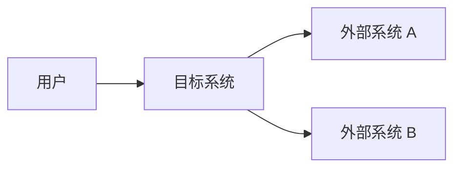
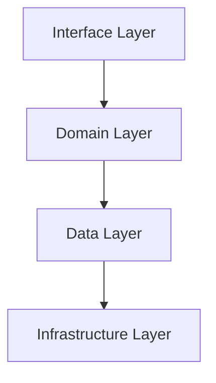
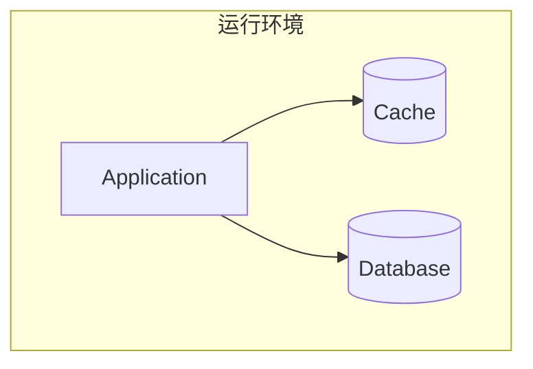
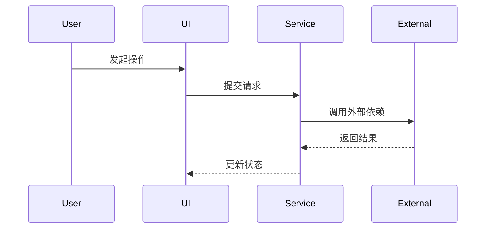

# 架构设计文档

## 1. 文档概览

### 1.1 背景与目标

### 1.2 范围与非范围

### 1.3 假设与限制

### 1.4 名词解释

## 2. 架构驱动因素

### 2.1 FR / NFR 摘要

### 2.2 关键质量属性

### 2.3 主要风险与约束

### 2.4 运行环境与资源预算

## 3. 架构模式与方案选择

### 3.1 选型结论

### 3.2 备选架构评估

### 3.3 演进路径

## 4. 架构全景图

### 4.1 系统上下文图

### 4.2 模块图 / 容器图

### 4.3 数据流图

### 4.4 部署架构图

### 4.5 关键动态行为

## 5. 模块划分与职责边界

| 模块 | 职责 | 公开接口 | 依赖 | 数据归属 | 禁止事项 |
| --- | --- | --- | --- | --- | --- |
| 示例模块 | 描述 | API / UseCase | 上下游依赖 | 负责的数据 | 禁止跨层直连 |

## 6. 数据模型与状态流转

### 6.1 核心实体

### 6.2 关系与约束

### 6.3 状态机 / 生命周期

### 6.4 一致性要求

## 7. 接口与集成设计

### 7.1 接口风格与通信方式

### 7.2 请求 / 响应模型

### 7.3 错误码、幂等性、超时与重试

### 7.4 外部系统集成策略

## 8. 安全设计

### 8.1 认证与授权

### 8.2 敏感数据保护

### 8.3 输入校验与攻击面防护

### 8.4 审计与追踪

## 9. 可观测性设计

### 9.1 日志

### 9.2 指标

### 9.3 链路追踪

### 9.4 告警与诊断

## 10. 部署、发布与演进

### 10.1 部署方案

### 10.2 灰度、回滚与兼容策略

### 10.3 演进路线图

## 11. 风险与待确认项

| 编号 | 风险/待确认项 | 影响 | 应对策略 |
| --- | --- | --- | --- |
| R1 | 示例 | 示例 | 示例 |
