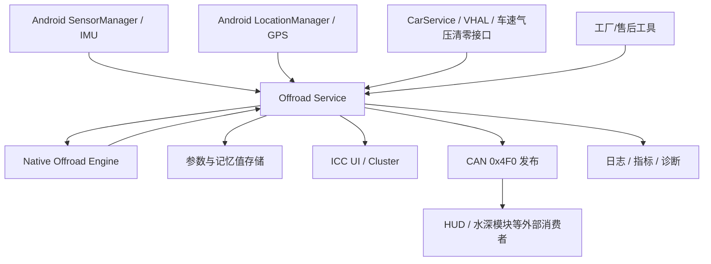
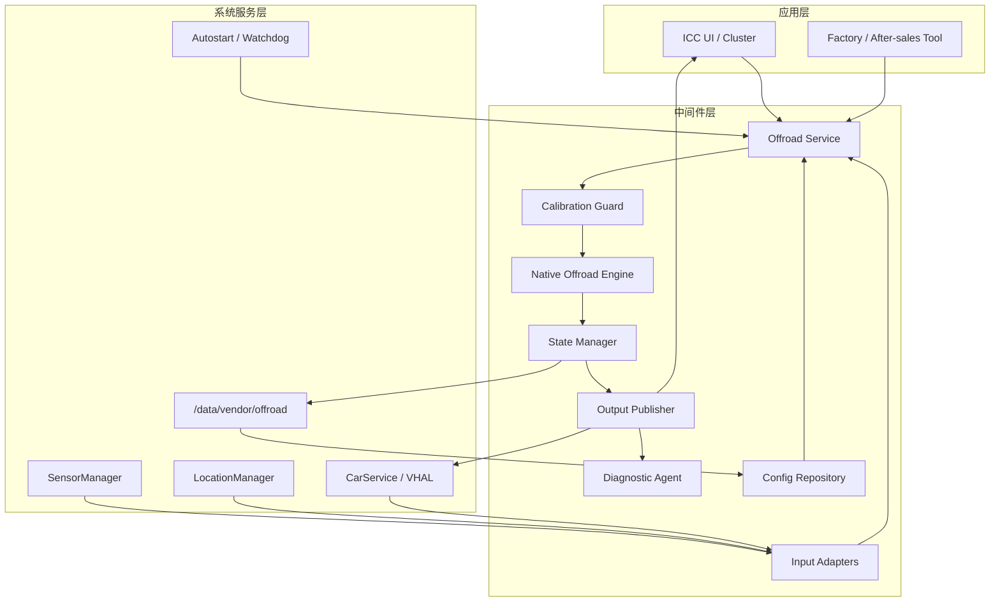
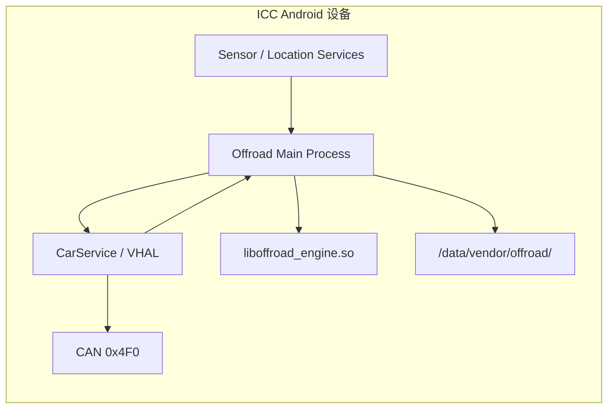
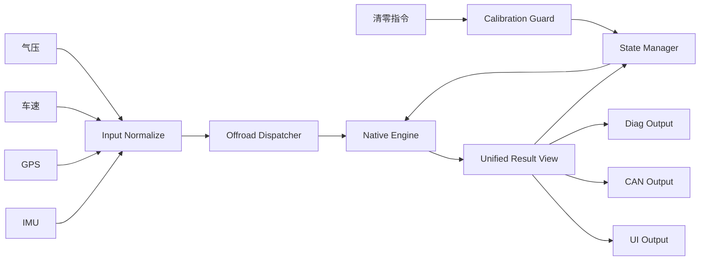
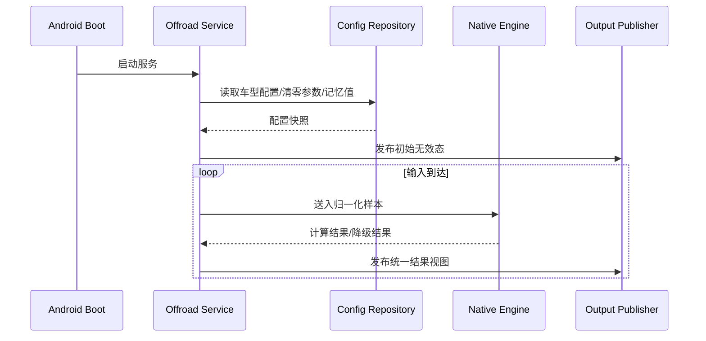
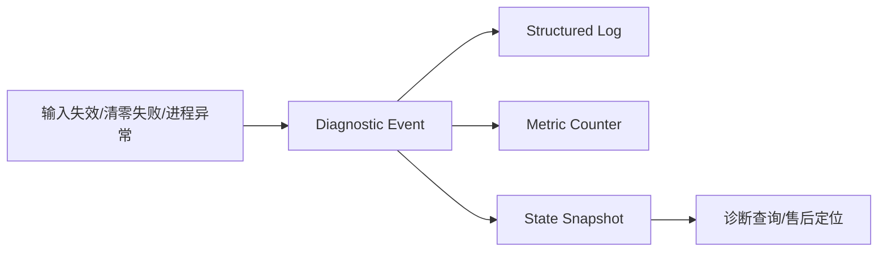
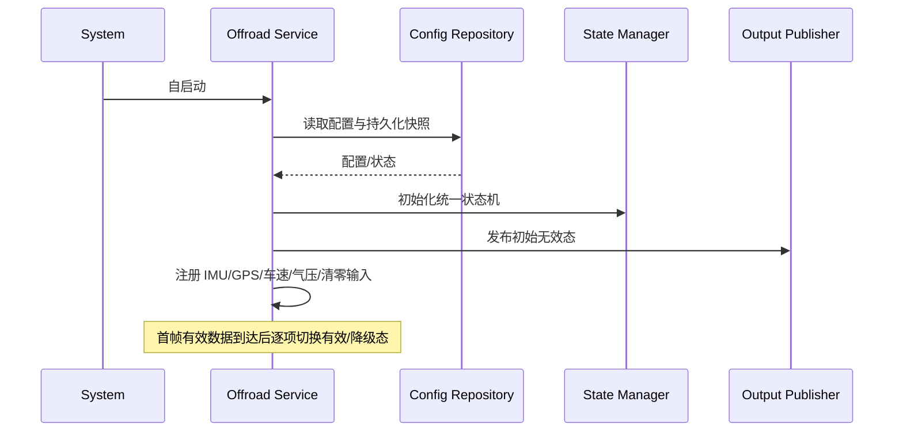

# 越野信息集成到车机架构设计

Generated at: 2026-04-17

| 属性 | 内容 |
| --- | --- |
| 关联需求 | `runs/task-20260417104007-cd19df/software-requirement-orchestrator/requirements_spec.md` |
| 目标平台 | ICC（Android 车机平台） |
| 方案定位 | Android 单 OS、单进程系统服务、Java + C++ JNI 混合中间件 |
| 架构范围 | 越野信息输入接入、算法承载、统一状态机、UI/CAN 发布、诊断与恢复 |

## 目录

1. 文档概览
2. 架构驱动因素
3. 架构模式与选型
4. 分层与边界设计
5. 架构视图
6. 通信与集成设计
7. 数据与状态设计
8. 安全与权限设计
9. 可观测性与诊断
10. 资源与运行时设计
11. 风险与待确认项

## 1. 文档概览

### 1.1 背景与目标

本方案面向 ICC 侧越野信息能力集成，覆盖车辆倾斜角、俯仰角、海拔、大气压力、指南针方向/角度以及姿态清零能力，并要求结果同时服务中控/仪表展示链路与 `0x4F0` 相关 CAN 外发链路（FUN-001~FUN-029）。架构目标不是冻结算法公式，而是在 Android 单 OS 平台下明确输入适配、计算执行、状态管理、统一发布、异常降级和自动恢复的责任边界，使系统在 12MB 安装包、1MB 运行内存、自启动和异常拉起约束下稳定运行（PERF-001、PLT-001、PLT-002、REL-001）。

### 1.2 范围与非范围

- **包含**：Android IMU/GPS 接入、车速/气压/清零输入适配、JNI 算法桥接、清零参数与指南针记忆值持久化、显示/CAN/诊断统一发布、升级恢复设计。
- **不包含**：算法数学公式细节、Android Framework 或驱动实现、DBC 位级定义、售后制度流程本身、未冻结接口参数的最终裁定。

### 1.3 假设与限制

- 当前版本只部署在 Android ICC，不引入 Linux/QNX 跨 OS 域与额外独立硬件模块（CON-001、ASM-006）。
- 指南针本版本不提供标定能力，必须通过统一状态机处理弱信号、失效和记忆值恢复（CON-002、FUN-016、FUN-018）。
- 海拔必须以大气压力为主输入、定位海拔为辅助校准来源，相关融合阈值在接口冻结前保持配置化（CON-003、FUN-013、OI-004）。
- 协议字段、刷新率、异常值编码、DBC 位定义和精度目标未冻结前，仅保留 `[待确认]` 占位，不在核心逻辑中固化（CON-005、CON-006、CFG-005）。

### 1.4 名词解释

| 名词 | 说明 |
| --- | --- |
| Offroad Service | 越野信息主服务，负责输入编排、状态机、对外发布和恢复 |
| Native Offroad Engine | 进程内 C++ 计算引擎，负责姿态、海拔、指南针计算与边界裁剪 |
| Unified Result View | 对 UI、CAN、诊断共享的唯一结果快照，统一有效/无效/降级三态 |
| Calibration Guard | 清零前置守卫，负责授权、条件检查、幂等和审计串行化 |

## 2. 架构驱动因素

### 2.1 FR / NFR 摘要

功能面需要形成“5 类输入、6 类计算能力、12 个统一输出信号、2 类持久化状态”的闭环：输入侧接 Android IMU、GPS、车速、EMS 气压和清零触发；计算侧输出倾斜角、俯仰角、海拔、气压、指南针方向与角度；状态侧管理清零基准与指南针记忆值；发布侧向 UI、CAN 和诊断同步发布同一结果语义（FUN-002~FUN-029、DAT-001、DAT-002）。非功能面强调上电自启动、首帧有效前不误报、单点输入异常不拖垮全链路、崩溃自动拉起、关键事件可追踪，以及清零能力只在受控场景开放（PERF-001、PERF-002、REL-001、REL-002、MNT-001、SAF-001、SEC-001）。

### 2.2 关键质量属性排序

1. **结果一致性**：UI、CAN、诊断必须复用同一份内部结果语义，不允许各自产生独立判定（CON-004、FUN-022）。
2. **稳定性与恢复性**：单一路径输入缺失、回调乱序或重复清零不得导致全链路错乱，异常退出后要能恢复（FUN-028、FUN-029、REL-001、REL-002）。
3. **启动与实时性**：上电后自动进入工作态，未获首帧有效数据前明确输出无效态，不输出伪正常值（FUN-001、PERF-001、SAF-001）。
4. **资源效率**：优先减少跨进程复制和重复缓存，满足 12MB / 1MB 平台预算（PLT-001）。
5. **可诊断与安全**：清零、降级、恢复、配置版本和输入合法性都要形成日志、指标和审计闭环（FUN-025、MNT-001、SAF-002、DIA-001）。

### 2.3 主要风险与约束

- **平台约束**：必须集成在 ICC 内运行，不新增外部硬件模块或独立守护进程（CON-001）。
- **业务约束**：指南针无标定能力、清零只在集成方式且满足静止平地前提时才可生效（CON-002、FUN-023、FUN-024）。
- **接口约束**：Android 输入细节、CAN `0x4F0` 编码、诊断码映射和刷新率尚未冻结，需要通过适配层和发布层隔离（OI-001、OI-002、OI-007）。
- **一致性约束**：统一状态机必须同时驱动 UI、CAN 和诊断，所有输出都要定义有效、无效、降级三态（CON-004、FUN-027）。

### 2.4 硬件、OS、通信与资源预算前置约束

| 维度 | 约束 |
| --- | --- |
| OS 组合 | 当前仅 Android 单 OS，不依赖 Linux/QNX 域 |
| 语言组合 | Java/Kotlin 负责系统集成与生命周期，C++ 负责核心计算 |
| 主通信方式 | Android Framework Callback、Binder/CarService、JNI、原子文件写入 |
| 资源预算 | 安装包不超过 12MB，运行内存不超过 1MB（PLT-001） |
| 启动恢复 | 跟随系统自启动，异常退出后由既有机制拉起并恢复状态（FUN-001、FUN-028、PLT-002） |

## 5. 架构视图

### 5.1 系统上下文图

Offroad Service 是唯一业务编排入口：向下吸收 Android 和车身接口差异，向内统一调度 JNI 算法引擎，向上同时服务显示、CAN 和诊断链路。这样可以把接口频率、异常语义、车型配置和 DBC 变化约束在适配层与发布层边界内，不把不确定性扩散到计算核心和消费方；同时清零、记忆值恢复和异常降级都由统一状态机驱动，满足“单一发布层 + 三态输出”的架构原则（FUN-019~FUN-029、CON-004、CON-005）。

## 3. 架构模式与选型

### 3.1 选型结论

采用 **Android 单进程系统服务 + 进程内 Native Engine + 统一状态机 + 单一发布层** 的方案：

- **Java/Kotlin 服务层**负责 Android `SensorManager`、`LocationManager`、CarService/VHAL 接入、权限、生命周期和对外编排。
- **C++ Native Engine** 承担姿态、海拔、指南针等数值计算、边界裁剪和降级计算逻辑。
- **State Manager** 集中维护清零参数、指南针记忆值、输入健康度、结果三态和恢复快照。
- **Output Publisher** 统一把同一结果视图映射到 UI、CAN 和诊断输出，禁止消费方各自二次计算。

该方案兼顾 Android 接口接入便利性和高频计算开销控制，满足当前单 OS、强资源约束和自动拉起要求（PLT-001、PLT-002、REL-001）。

### 3.2 备选方案评估

| 方案 | 优点 | 缺点 | 结论 |
| --- | --- | --- | --- |
| Java 单体服务 | Android 接口接入直接，部署简单 | 高频计算与状态管理堆叠在托管堆，GC 抖动和复用性风险更高 | 不选 |
| 独立 native daemon + Java 代理 | 算法解耦明显，可独立升级 | 需要新增 IPC、守护、权限和恢复链路，超出当前 1MB 内存预算风险更高 | 当前阶段不选 |
| **Java 服务 + JNI Native Engine** | 接入直接、计算轻量、边界清晰、资源成本最低 | 需要严格控制 JNI DTO 与线程模型 | **选用** |

### 3.3 演进路径

1. 当前版本先在 Android ICC 内完成闭环，不引入额外跨进程和跨域代理。
2. 若后续算法需独立升级，可把 Native Engine 提升为 vendor native service，并保留当前 Java 服务接口作为兼容外观。
3. 若后续座舱/仪表拆域，则在 `Output Publisher` 前增加跨域代理层，统一状态机和结果模型保持不变。

## 4. 分层与边界设计

### 4.1 应用层 / 中间件层 / 驱动与系统服务层

| 层级 | 模块 | 职责 |
| --- | --- | --- |
| 应用层 | ICC UI、Cluster/HUD 消费方、工厂/售后工具 | 展示越野信息、消费统一结果、触发清零业务入口 |
| 中间件层 | Offroad Service、Input Adapters、Calibration Guard、Native Engine、State Manager、Output Publisher、Diagnostic Agent、Config Repository | 输入归一化、算法计算、状态机、持久化、统一发布、诊断与审计 |
| 驱动/系统服务层 | Android Sensor/Location Framework、CarService/VHAL、文件系统、watchdog / 自动拉起机制 | 提供底层数据、系统生命周期、持久化介质与恢复能力 |

### 4.2 OS 边界

| 边界项 | 设计 |
| --- | --- |
| OS 组合 | 当前仅 Android；不依赖 Linux/QNX 运行域 |
| 系统接口 | 通过 Android Framework 和 CarService/VHAL 获取传感器与车身信号 |
| 启动方式 | 跟随系统服务白名单或既有自启动机制启动（FUN-001、PLT-002） |
| 恢复方式 | 由系统保活/拉起机制恢复，恢复后先读取持久化快照，再进入工作态（FUN-028、DAT-001、DAT-002） |

### 4.3 进程与服务边界

| 进程/服务 | 归属 | 关键职责 | 失效影响 |
| --- | --- | --- | --- |
| `Offroad Main Process` | Android 中间件进程 | 承载 Offroad Service、适配器、状态管理、输出发布 | 主业务中断，但可由系统自动拉起 |
| `liboffroad_engine.so` | 进程内 C++ 库 | 执行姿态、海拔、指南针计算与结果裁剪 | 计算能力不可用，进程仍可输出诊断和无效/降级态 |
| `CarService/VHAL` | Android 系统服务 | 提供车速、气压、清零输入与车机侧发布通道 | 影响相关功能，其他输入链路保持独立 |
| `Sensor/Location Service` | Android 系统服务 | 提供 IMU 与 GPS | 影响姿态/海拔/指南针结果，但不应拖垮清零与持久化链路 |

### 4.4 Java / C++ 语言边界

| 能力 | Java/Kotlin | C++ |
| --- | --- | --- |
| Android API / 权限 / 生命周期 | 负责 | 不负责 |
| 输入合法性初筛 | 负责空值、来源、时间戳、注册状态校验 | 负责数值范围、算法前置条件和输出边界校验 |
| 算法执行 | 负责调度与参数封装 | 负责计算核心与降级路径 |
| 持久化 | 负责文件读写、版本检查和恢复 | 提供可序列化计算态 |
| 错误语义 | 统一转成结果状态、诊断码和审计日志 | 返回明确状态码，不使用不可追踪异常 |

JNI 仅传递轻量 DTO：IMU 样本、GPS 样本、气压样本、车速状态、配置快照、清零参数和统一结果，不跨语言共享复杂对象。

## 5. 架构视图

### 5.2 容器 / 模块图

### 5.3 服务部署图

### 5.4 关键数据流图

### 5.5 关键动态行为图

## 6. 通信与集成设计

### 6.1 通信方式选型矩阵

| 通信边界 | 方式 | 数据类型 | 选择理由 |
| --- | --- | --- | --- |
| Java 服务 ↔ Android Sensor/Location | Android Framework Listener/Callback | IMU、GPS 样本 | 与平台标准接口对齐，减少自定义桥接 |
| Java 服务 ↔ CarService/VHAL | Binder/系统服务接口 | 车速、气压、清零、显示/CAN 发布 | 复用车机既有车身能力，权限和生命周期统一 |
| Java 服务 ↔ Native Engine | JNI 进程内调用 | 计算输入、配置快照、结果 DTO | 时延和内存成本最低，适合高频计算 |
| State Manager ↔ 文件系统 | 原子文件写入/KV | 清零参数、指南针记忆值、运行快照 | 数据量小、可恢复性强 |
| Output Publisher ↔ UI | 进程内回调或系统服务接口 | 统一结果视图 | 防止 UI 端各自重算，保证口径一致 |
| Output Publisher ↔ CAN `0x4F0` | 车机既有 CAN 发布接口 | 信号映射后的结果 | 保持与正式 DBC 对齐能力，未冻结字段配置化 |

### 6.2 请求-响应 / 发布-订阅 / 事件流设计

- **发布-订阅**：IMU、GPS、车速、气压输入采用事件驱动；各输入适配器分别维护新鲜度和健康度，不互相阻塞。
- **请求-响应**：清零请求必须经过 `Calibration Guard` 同步判定，返回“接受/拒绝 + 原因码”，并记录审计日志（FUN-023~FUN-025、SEC-001）。
- **统一事件流**：计算结果进入 `Unified Result View` 后，由 `Output Publisher` 一次发布到 UI、CAN 和诊断，保证同一时间片内结果口径一致（FUN-019~FUN-022）。

### 6.3 接口命名、版本、错误码与超时重试

- 需求阶段保留原始规范中的接口命名与拼写，正式实现通过适配层建立“原始名 ↔ 运行时定义名”映射，并记录版本来源（CFG-005、OI-001、OI-002）。
- 输入适配器为每类输入维护 `last_update_ts`、`quality_flag`、`source_state`；超过阈值即切换无效或降级态，阈值待接口文档冻结后落参（FUN-027、OI-007）。
- JNI 返回统一错误码：`OK`、`INVALID_INPUT`、`DEGRADED`、`STATE_ERROR`、`CAL_REJECTED`，禁止用无语义异常替代业务错误。
- 清零与持久化失败不做静默重试；必须记录审计日志并由上层明确触发下一次请求（FUN-025、DAT-002、REL-002）。

### 6.4 外部系统、总线与诊断集成

| 外部对象 | 集成内容 | 架构要求 |
| --- | --- | --- |
| Android IMU/GPS | 姿态、航向、高度输入 | 接口频率、精度和异常码待与平台团队冻结 |
| CarService/VHAL | 车速、气压、清零触发与车机侧发布通道 | 使用系统权限和既有信号服务，不直连底层驱动 |
| CAN `0x4F0` | 越野信息对外发送 | 发布层单点完成信号映射、周期控制和异常值编码 |
| 工厂/售后工具 | 清零入口、配置授权 | 只能通过授权链路触发，不直接调用算法引擎 |
| 诊断/日志平台 | 关键事件与状态查询 | 记录启动、降级、恢复、清零成败和配置版本 |

## 7. 数据与状态设计

### 7.1 核心实体与全局数据

| 实体 | 关键字段 | 说明 |
| --- | --- | --- |
| `InputSnapshot` | imu/gps/speed/baro 样本、时间戳、健康度 | 输入归一化后的统一视图 |
| `VehiclePoseResult` | roll/pitch/value/status | 姿态结果及三态 |
| `AltitudePressureResult` | pressure/altitude/status/source_mode | 海拔与气压结果及降级来源 |
| `CompassResult` | direction/angle/status/memory_source | 指南针结果及记忆值来源 |
| `CalibrationState` | zero_offset、auth_state、last_request_id | 清零状态、幂等键和授权结果 |
| `PersistedState` | calibration、compass_memory、config_version | 需要跨重启保留的状态 |
| `UnifiedResultView` | 12 个输出信号、有效性、序列号、更新时间 | UI/CAN/诊断共享的唯一输出快照 |

### 7.2 状态机与生命周期

系统统一状态机定义为：`BOOTSTRAP` → `READY_INVALID` → `ACTIVE_VALID / ACTIVE_DEGRADED` → `FAULT_RECOVERING`。其中：

1. 启动后先加载配置与持久化数据，加载成功进入 `READY_INVALID`，未获首帧有效输入前只发布无效态（FUN-001、DAT-001、DAT-002）。
2. 当对应输入满足计算条件时，各结果子状态进入 `ACTIVE_VALID`。
3. 当 GPS 丢失但气压可用等场景出现时，仅相关结果进入 `ACTIVE_DEGRADED`，并携带降级原因（FUN-013、FUN-016、FUN-027）。
4. 输入恢复后从降级态切回有效态；进程恢复或配置损坏时进入 `FAULT_RECOVERING`，重建状态后再发布结果（FUN-028、REL-001、REL-002）。

### 7.3 一致性、缓存与恢复策略

- `State Manager` 持有唯一的 `Unified Result View`，UI、CAN 和诊断不得各自缓存独立业务态（FUN-022）。
- 清零参数和指南针记忆值采用原子写入；写成功前不切换对外生效版本，避免掉电损坏（FUN-017、FUN-018、DAT-001、DAT-002）。
- 重复清零通过 `last_request_id + cooldown window` 实现幂等保护；恢复时若发现未完成事务，则回滚到最近一次成功快照（FUN-029、REL-002）。

## 8. 安全与权限设计

### 8.1 权限边界

| 对象 | 所需权限/边界 | 设计要求 |
| --- | --- | --- |
| Offroad Service | 传感器、定位、车身信号、文件读写、系统自启动权限 | 仅系统签名服务持有；UI 不直接触达底层输入 |
| 工厂/售后工具 | 清零授权入口 | 只能发起业务请求，不可绕过 `Calibration Guard` |
| Native Engine | 进程内计算权限 | 不直接访问 Android API、文件系统和总线 |
| Output Publisher | UI/CAN/诊断发布能力 | 只消费统一结果视图，不接受外部伪造结果 |

### 8.2 敏感数据保护

- 持久化内容仅包含清零参数、指南针记忆值、配置版本和必要运行快照，不落地原始 IMU/GPS 连续数据。
- 配置和状态文件采用目录级访问控制与完整性校验；发现损坏时进入受控降级并生成诊断事件，不静默忽略。
- 清零相关请求和结果必须记录请求来源、授权状态、判定结果和失败原因，满足售后追溯（SEC-001、SAF-002）。

### 8.3 审计与追踪

清零能力拆成 **授权判定 → 条件检查 → 标定执行 → 参数持久化 → 发布结果** 五个独立环节，每个环节均输出审计记录。审计最少包含 `request_id`、`actor`、`vehicle_state`、`result_code`、`config_version`、`persist_version`，用于满足 FUN-025、SAF-002、SEC-001。

### 8.4 升级链路安全

- 升级包仅替换服务实现、Native Engine 与默认配置，不直接覆盖上一次成功清零参数。
- 升级后先做配置版本与持久化格式校验；若迁移失败，则保留旧快照并以无效/降级态启动。
- 若后续引入独立 native service，需补充签名校验和接口版本兼容门禁。

## 9. 可观测性与诊断

### 9.1 日志与脱敏

| 日志类型 | 触发点 | 关键字段 |
| --- | --- | --- |
| 生命周期日志 | 启动、恢复、退出 | state、uptime、config_version |
| 输入健康日志 | IMU/GPS/车速/气压失效或恢复 | source、quality_flag、last_update_ts |
| 清零审计日志 | 申请、拒绝、执行、持久化成功/失败 | request_id、actor、reason、persist_version |
| 发布一致性日志 | UI/CAN/诊断发布 | result_state、publish_seq、output_mask |

日志记录业务状态和错误码，不记录完整定位轨迹、原始高频 IMU 连续样本等不必要数据。

### 9.2 指标与告警

建议最小指标集：

- `offroad_input_age_ms{source}`
- `offroad_result_state_total{signal,state}`
- `offroad_calibration_attempt_total{result}`
- `offroad_restart_count`
- `offroad_persist_failure_total`

当出现连续输入超时、反复重启、持久化失败或清零拒绝率异常时触发告警。

### 9.3 故障诊断与定位链路

诊断链路要求能够从任一异常结果反查到输入源状态、当前配置版本、清零判定结果和最近一次成功持久化版本，保证问题可复现、可定位、可追责（DIA-001、MNT-001）。

### 9.4 再发防止与经验回灌

- 对重复清零、输入抖动和恢复抖动建立场景标签，沉淀为回归测试用例。
- 风险关闭后同步更新配置约束、错误码表和诊断字典，避免相同问题跨车型再发。

## 10. 资源与运行时设计

### 10.1 启动时序与依赖

### 10.2 CPU / RAM / ROM 预算

| 资源项 | 预算/目标 | 设计手段 |
| --- | --- | --- |
| 安装包空间 | `<= 12MB` | 单进程服务、Native Engine 轻量化、无额外守护进程 |
| 运行内存 | `<= 1MB` | 只保留最近样本、统一结果视图和少量持久化缓存 |
| CPU | 不引入常驻 busy loop；高频计算限定在单工作线程内 | 事件驱动、JNI DTO 轻量化、避免重复发布 |
| 启动时间 | 满足系统自启动窗口；精确阈值待接口/平台冻结 | 先发布无效态，再等待输入转有效 |
| 输出刷新 | 跟随正式接口定义；精确周期待 DBC/接口冻结 | 发布层统一节拍控制 |

### 10.3 稳定性、隔离与恢复策略

- 输入链路按源隔离，任一输入源失效只影响其依赖结果，不级联污染其他结果（FUN-027、REL-002）。
- 计算异常和持久化异常都必须转换成明确的无效/降级态，不允许线程静默退出（SAF-001、REL-001）。
- 进程被拉起后优先恢复最近一次成功快照；快照非法时退回默认配置并输出诊断（FUN-028、DAT-001、DAT-002）。

### 10.4 升级、灰度、回滚与兼容性

- 当前版本采用整包升级，配置和持久化数据独立于程序包存放。
- 配置版本采用显式 schema version；新版本必须提供向后兼容解析或迁移逻辑。
- 升级失败或回滚时继续使用最近一次成功持久化状态，避免清零参数和记忆值丢失。

## 11. 风险与待确认项

| 编号 | 风险/待确认项 | 影响 | 应对策略 |
| --- | --- | --- | --- |
| R1 | Android IMU/GPS 接口频率、精度、时间戳语义未冻结 | 高：影响输入缓存、超时判定和精度验收 | 在 `Input Adapters` 保留参数化时效判定，接口冻结后再收紧 |
| R2 | CAN `0x4F0` DBC、异常值编码和发送周期未提供 | 高：影响发布层实现和总线联调 | 先固化 `Output Publisher` 结果模型，信号映射表后置配置化 |
| R3 | 清零授权边界、成功回执和失败重试规则未完全明确 | 高：影响安全和售后流程闭环 | 通过 `Calibration Guard` 预留原因码与审计字段，待业务冻结 |
| R4 | 指南针无标定前提下的失效判定与恢复口径未统一 | 中：影响 UI 体验和测试口径 | 结果模型保留 `DEGRADED` 与 `memory_source` 字段 |
| R5 | 海拔/气压融合算法精度指标和降级阈值未明确 | 中：影响算法验收和参数设计 | 将融合阈值做成配置项，联调前冻结测试基线 |
| R6 | 车型姿态与 IMU 安装姿态配置来源、格式和版本下发方式未明确 | 中：影响多车型部署与回滚 | `Config Repository` 采用版本化配置快照接口，先与实现解耦 |
| R7 | 原规范信号命名与正式接口定义可能不一致 | 中：影响需求、实现和测试一致性 | 适配层维护命名映射并要求联调前统一版本 |
| R8 | 1MB RAM 预算较紧，若引入多进程或大缓存将直接超预算 | 中：影响部署与稳定性 | 保持单进程、最近样本缓存和小型持久化模型 |
| R9 | 自动拉起恢复时若叠加重复清零请求，存在状态损坏风险 | 中：影响参数一致性 | 恢复阶段先锁定 `Calibration Guard`，基于幂等键串行化处理 |

*文档结束*
