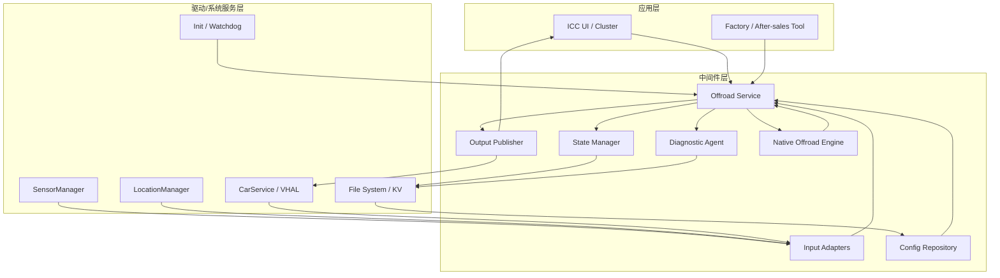
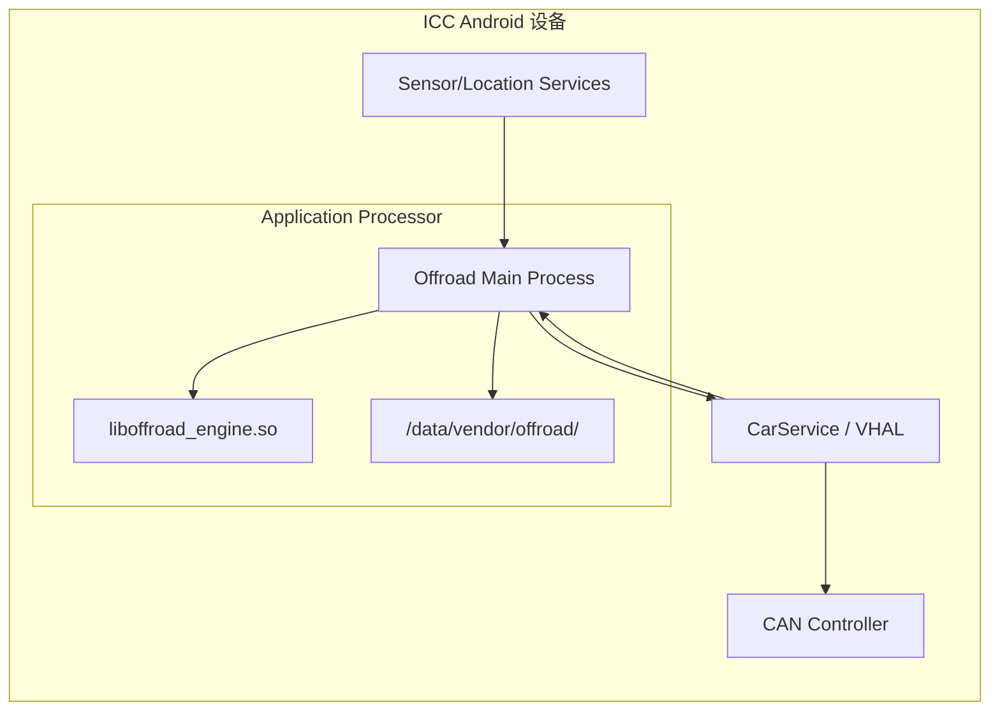
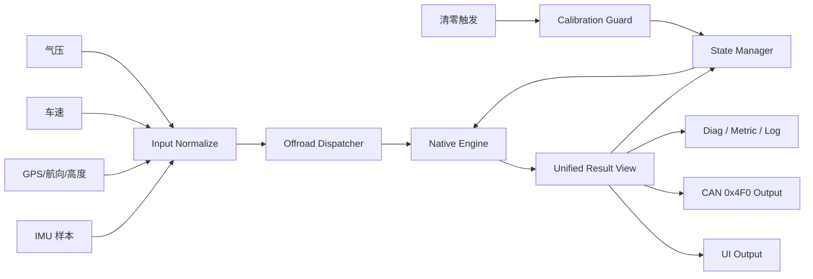
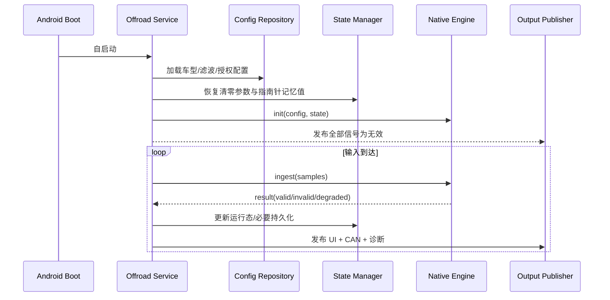
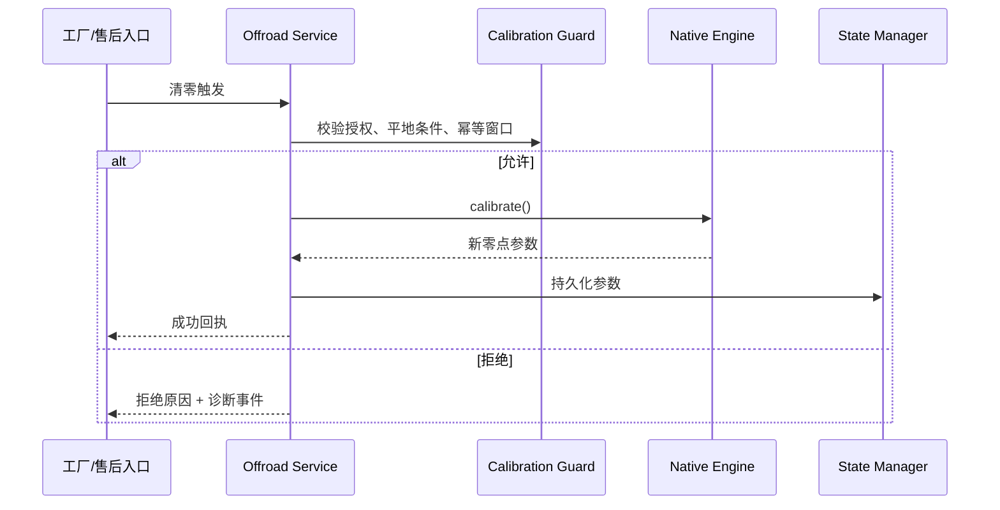

# 越野信息集成到车机架构设计

Generated at: 2026-04-14

| 属性 | 内容 |
| --- | --- |
| 关联需求 | `software-requirement-orchestrator/requirements_spec.md` |
| 目标平台 | ICC（Android 车机平台） |
| 方案定位 | Android 单 OS、Java + C++ 混合中间件 |
| 架构范围 | 越野信息算法接入、计算、持久化、显示输出、CAN 外发、诊断与恢复 |

## 1. 文档概览

### 1.1 背景与目标

本方案面向 ICC 侧越野信息算法集成，交付车辆倾斜角、俯仰角、海拔、大气压力、指南针方向/角度以及清零能力，并保证结果可在中控/仪表显示、可经 CAN 0x4F0 对外分发（FUN-001 ~ COM-003）。架构目标不是重写算法公式，而是在 Android 车机内明确输入适配、算法承载、状态持久化、输出发布、异常降级和自动恢复的边界，使系统在 12MB 安装空间、1MB 运行内存、自启动和异常拉起约束下仍可稳定运行（PLT-002、PERF-001、REL-001）。

### 1.2 范围与非范围

- **包含**：Android 传感器/定位接入、车速与气压输入接入、JNI 算法桥接、清零与记忆值持久化、显示/总线发布、日志与诊断事件、升级回滚和故障恢复。
- **不包含**：算法数学模型细节、Android Framework/驱动实现、DBC 位级定义、工厂/售后流程制度本身、缺失接口文档的最终协议裁定。

### 1.3 假设与限制

- 假设越野信息运行于单一 Android ICC，不涉及 Linux/QNX 跨 OS 部署；若后续平台演进为异构域控，需要在代理层补跨域通信适配。
- 假设 Android 标准传感器与定位接口可由系统权限服务稳定获取，车速/气压/清零输入通过车机既有车身接口接入（SYS-002、PLT-001）。
- 因《安卓接口需求说明》、0x4F0 DBC、清零授权边界和车型配置下发方式尚未闭合，本文以“适配器隔离 + 明确待确认项”控制风险，不在架构中固化未确认协议（OI-002、OI-004、OI-006、OI-007）。

### 1.4 名词解释

- **Offroad Service**：运行在 Android 进程内的越野信息中间件服务。
- **Native Engine**：通过 JNI 调用的 C++ 算法执行体。
- **Input Adapter**：对 Android Sensor/Location 与车身接口做统一封装的接入层。
- **Output Publisher**：负责向显示链路与 CAN 外发结果的发布层。

## 2. 架构驱动因素

### 2.1 FR / NFR 摘要

功能面必须形成 5 类输入、6 类能力、12 个输出信号和 2 类持久化状态的闭环：输入侧接 Android IMU、GPS、车速、EMS 气压和清零触发；计算侧产出倾斜角、俯仰角、海拔、气压、指南针方向/角度；状态侧管理清零参数和指南针记忆值；输出侧同时服务 UI 与 CAN（SYS-001 ~ DAT-002）。非功能面重点是上电自启动、输入失效可降级、异常退出自动拉起、资源受限、关键日志可追踪和清零安全受控（PERF-001、REL-001、MNT-001、SAF-001）。

### 2.2 关键质量属性排序

1. **结果正确性与状态一致性**：有效/无效/降级三态必须对外一致（DIA-002）。
2. **稳定性与可恢复性**：单点输入异常不得拖垮全链路，进程异常后需自动恢复（REL-001、REL-002）。
3. **启动与实时输出连续性**：上电自动启动，首帧有效前不误报有效值（SYS-002、PERF-001）。
4. **资源效率**：满足 12MB ROM、1MB RAM 预算，避免多进程和重缓存（PLT-002）。
5. **可诊断性与可维护性**：关键事件、配置版本、运行态均可观察（MNT-001、MNT-002、DIA-001）。
6. **安全与权限控制**：清零能力仅在允许场景开放，非法输入不得进入有效输出链路（SAF-001、SEC-001）。

### 2.3 主要风险与约束

- Android 接口频率、时间戳和异常语义未定，决定输入缓冲、超时和插值策略（OI-002）。
- DBC 未提供，CAN 发布器只能预留抽象信号映射层，不能固化位定义（OI-004）。
- 指南针融合精度、静止阈值、GPS 丢失恢复策略未量化，要求算法引擎与状态机解耦，便于后续替换参数（OI-003、OI-008）。
- 清零权限、成功回执和防误触边界未闭合，需把授权判定从算法执行路径中独立出来（OI-006）。

### 2.4 硬件、OS、通信与资源预算前置约束

系统运行在 Android ICC 上，优先采用**单进程系统服务 + 进程内 Native Engine**方案，避免额外 IPC 和内存镜像；Java 层负责 Android API 与车身服务接入，C++ 层负责计算密集逻辑，二者通过稳定 JNI 接口桥接。对外通信优先使用 Android Binder/CarService 接入车身接口、JNI 进程内调用算法、文件系统做少量持久化、CAN/VHAL 发布最终结果，从而在资源受限场景下控制复杂度和故障面。

## 3. 架构模式与选型

### 3.1 选型结论

采用 **Android 单进程系统服务 + 进程内 Native Engine + 适配器隔离** 的分层架构：

- **Java/Kotlin 系统服务层**承接 Android `SensorManager`、`LocationManager`、CarService/VHAL 等系统接口，负责权限、生命周期、输入订阅和对外发布编排。
- **C++ Native Engine** 聚焦姿态/海拔/指南针计算、边界裁剪和计算态管理，避免在 Java 层堆叠高频数值计算。
- **State & Publish 层**统一管理清零参数、指南针记忆值、有效位、诊断事件和 CAN/UI 输出，确保一个结果源被多消费方复用（COM-001、COM-002、DAT-001、DAT-002）。

该方案满足 Android 平台接口接入便利性，同时避免“Java 全栈算法导致高频对象分配”和“独立 native daemon 额外 IPC/守护复杂度”两类问题，适合当前单 OS、强资源约束场景（PLT-001、PLT-002）。

### 3.2 备选方案评估

| 方案 | 优点 | 缺点 | 结论 |
| --- | --- | --- | --- |
| Java 单体服务 | 接 Android 接口最直接，部署简单 | 高频计算与状态管理全在托管堆，GC 抖动风险更高；算法复用性较差 | 不选 |
| 独立 native daemon + Java 代理 | 算法与接入解耦明显，native 复用强 | 需要 Binder/Socket 桥接、守护与拉起链路更复杂，内存更高 | 当前阶段不选 |
| **Java 服务 + JNI Native Engine** | 接口接入直接、计算路径轻、边界清晰、资源成本最低 | 需要控制 JNI 边界与线程模型 | **选用** |

### 3.3 演进路径

当前版本先实现单 ICC 内闭环；后续若出现以下变化，架构按兼容路径演进：

1. 若算法团队要求独立版本发布，可把 Native Engine 提升为 vendor native service，Java 层改为 Binder 客户端。
2. 若 0x4F0 输出切换为统一车身信号服务，可保留 `Output Publisher` 接口，只替换具体适配器实现。
3. 若车型配置集中下发，可把本地文件配置源切为配置中心拉取，但 `Config Repository` 对上接口不变。

## 4. 分层与边界设计

### 4.1 应用层 / 中间件层 / 驱动与系统服务层

| 层级 | 模块 | 职责 |
| --- | --- | --- |
| 应用层 | ICC UI、Cluster/HUD 消费方、工厂/售后配置入口 | 展示越野信息、触发清零入口、消费 CAN 外发结果 |
| 中间件层 | Offroad Service、Input Adapters、Native Engine、State Manager、Output Publisher、Diagnostic Agent | 输入汇聚、算法计算、状态机、持久化、对外发布、诊断闭环 |
| 驱动/系统服务层 | Android Sensor/Location Framework、CarService/VHAL、文件系统、init/保活机制 | 提供底层数据、系统生命周期、持久化介质和异常拉起能力 |

中间件层是单一编排核心，外部消费方不直接依赖 Android 原始输入，也不直接操作 Native Engine，从而避免多方共享状态导致的不一致。

### 4.2 OS 边界

| 边界项 | 设计 |
| --- | --- |
| OS 组合 | 当前仅 Android；无 Linux/QNX 跨域依赖 |
| 系统接口 | 通过 Android Framework/CarService 获取标准传感器与车身信号 |
| 启动方式 | 跟随系统服务或白名单自启动机制启动（PERF-001） |
| 恢复方式 | 由 Android 进程保活/拉起机制恢复，恢复后读取持久化状态（REL-001） |

### 4.3 进程与服务边界

| 进程/服务 | 归属 | 关键职责 | 失效影响 |
| --- | --- | --- | --- |
| `com.baic.offroad` 主进程 | Android 中间件 | 承载 Offroad Service、适配器、状态管理、输出发布 | 主业务中断，但可被系统重新拉起 |
| `NativeOffroadEngine`（进程内 `.so`） | C++ | 计算姿态、海拔、指南针，处理数值裁剪 | 计算不可用，但进程仍可记录诊断并重建 |
| `CarService/VHAL` | Android 系统服务 | 提供车速、气压、清零相关车身数据 | 相关输出降级，不影响其他输入源 |
| `Sensor/Location Service` | Android 系统服务 | 提供 IMU/GPS | 影响姿态/海拔/指南针对应能力 |

### 4.4 Java / C++ 语言边界

| 能力 | Java/Kotlin | C++ |
| --- | --- | --- |
| 生命周期与权限 | 负责 | 不负责 |
| Android API 接入 | 负责 | 不直接接入 |
| 输入合法性初筛 | 负责时间戳/空值/来源校验 | 负责数值范围与计算前置条件校验 |
| 算法执行 | 负责调度与参数封装 | 负责计算核心 |
| 状态持久化 | 负责文件读写与恢复 | 提供可序列化状态结构 |
| 错误语义 | 转为统一错误码/诊断事件 | 返回明确状态码，不抛无语义异常 |

JNI 边界只传递轻量 DTO：传感器样本、GPS 样本、车型配置、清零参数和计算结果，避免跨语言共享复杂对象。

## 5. 架构视图

### 5.1 系统上下文图

```mermaid
graph TD
    AndroidSensor["Android SensorManager / IMU"] --> OffroadSvc["Offroad Service"]
    AndroidLocation["Android LocationManager / GPS"] --> OffroadSvc
    VehicleBus["CarService / VHAL / 车速气压清零接口"] --> OffroadSvc
    OffroadSvc --> NativeEngine["Native Offroad Engine"]
    NativeEngine --> OffroadSvc
    OffroadSvc --> Persist["Param Store / 记忆值存储"]
    OffroadSvc --> Display["ICC UI / Cluster UI"]
    OffroadSvc --> CanPub["CAN 0x4F0 Publisher"]
    OffroadSvc --> Diag["Log / Metrics / Diagnostic Events"]
    FactoryTool["工厂/售后配置入口"] --> VehicleBus
    HUD["HUD / 水深模块等"] <-- CanPub
```

系统上下文中，Offroad Service 是唯一业务编排入口：向下吸收 Android 与车身输入差异，向内统一调度 Native Engine，向上同时服务显示链路、外发链路和诊断链路。这样可以把 Android 标准接口的不确定性、车型配置差异和 CAN 映射变化限制在适配器边界内，而不会扩散到算法核心与 UI 使用方；同时清零、记忆值恢复和异常降级都以 Offroad Service 为单一状态协调点，满足输入失效隔离、输出一致性和可恢复性要求（SYS-001、ERR-004、CC-001、REL-002）。

### 5.2 容器 / 模块图



**模块分工**

| 模块 | 职责 | 追溯 |
| --- | --- | --- |
| `Input Adapters` | 统一 IMU、GPS、车速、气压、清零输入模型，做去抖、时间戳对齐和初筛 | SYS-002、SEC-001 |
| `Offroad Service` | 管理生命周期、状态机、调度 Native Engine、协调发布与持久化 | SYS-001、REL-002 |
| `Native Offroad Engine` | 输出倾斜角、俯仰角、海拔、指南针及有效性结果 | FUN-001 ~ FUN-015 |
| `State Manager` | 管理清零参数、指南针记忆值、运行态快照 | DAT-001、DAT-002、CC-001 |
| `Output Publisher` | 向 UI 和 CAN 0x4F0 发布统一结果视图 | COM-001、COM-002、COM-003 |
| `Diagnostic Agent` | 记录关键日志、指标、故障事件和版本信息 | MNT-001、MNT-002、DIA-001 |
| `Config Repository` | 加载车型姿态、滤波参数、清零开关等配置 | CFG-001 ~ CFG-005 |

### 5.3 服务部署图



部署上坚持一个主业务进程：输入订阅、算法调度、状态持久化和对外发布全部驻留在同一进程中；持久化目录仅保存少量配置版本、清零参数、指南针记忆值和运行快照，不承载历史大日志，避免超出 ROM/RAM 预算（PLT-002）。

### 5.4 关键数据流图



关键原则是**先归一化输入、再执行计算、最后统一发布结果**。显示和 CAN 不各自做二次计算，只消费 `Unified Result View`，从设计上保证有效位、数值和降级状态一致（COM-001、COM-002、DIA-002）。

### 5.5 关键动态行为图





## 6. 通信与集成设计

### 6.1 通信方式选型矩阵

| 边界 | 通信方式 | 数据类型 | 选择原因 |
| --- | --- | --- | --- |
| Android 传感器/定位 -> Offroad Service | Framework API / Listener 回调 | IMU、GPS 样本 | 原生标准接口，避免额外桥接（SYS-002） |
| CarService/VHAL -> Offroad Service | Binder/CarProperty 回调 | 车速、气压、清零触发 | 适合车身属性接入，易于做权限控制 |
| Offroad Service -> Native Engine | JNI 同进程调用 | 计算输入、配置、状态恢复 | 延迟低、无额外序列化进程边界 |
| Offroad Service -> State Store | 文件/KV 读写 | 清零参数、记忆值、版本 | 数据量小、重启恢复简单（DAT-001、DAT-002） |
| Offroad Service -> UI | 进程内接口或 Binder | 统一结果视图 | 复用 Android 展示链路 |
| Offroad Service -> CAN | CarService/VHAL 写属性或 vendor 接口 | 0x4F0 输出信号 | 便于与车身总线统一对接 |
| Offroad Service -> Diagnostic | 结构化日志/指标事件 | 运行态、故障、配置版本 | 支撑定位和追溯 |

### 6.2 请求-响应 / 发布-订阅 / 事件流设计

- **发布-订阅**：IMU、GPS、车速、气压输入均采用事件订阅，按时间戳进入统一缓冲。
- **请求-响应**：清零触发、配置查询、运行态查询采用请求-响应，以便返回拒绝原因、配置版本和状态快照。
- **事件流**：启动、降级、恢复、清零成功/失败、输入失效、进程重建等作为结构化事件写入诊断链路。

### 6.3 接口命名、版本、错误码与超时重试

- 对外信号名在需求阶段保留原规范命名，内部模型统一维护 `canonical_name` 与 `source_name` 双字段，缓冲拼写差异风险（CMP-001）。
- 配置、持久化和 JNI 接口均带版本号；旧版本状态文件恢复失败时进入“默认配置 + 全量无效输出 + 诊断告警”安全模式。
- 统一错误码建议：
  - `E_INPUT_TIMEOUT`
  - `E_INPUT_INVALID`
  - `E_CONFIG_INVALID`
  - `E_CALIBRATION_REJECTED`
  - `E_STATE_RESTORE_FAILED`
- 传感器类输入不做主动重试，由订阅回调持续供数；持久化写入和 CAN 发布采用有限重试，超过阈值后告警但不阻塞主循环。

### 6.4 外部系统、总线与诊断集成

- Android 标准定位/传感器接口：由 `Input Adapters` 统一做频率和时间戳适配，兼容 OI-002 未闭合项。
- EMS 气压与车速接口：通过车机既有车身服务接入，信号名与车身映射表解耦，便于后续统一到正式 DBC/接口表。
- CAN 0x4F0 外发：由 `Output Publisher` 维护“内部结果字段 -> 报文字段”映射；DBC 未到位前只定义逻辑信号，不定义位偏移常量（COM-003）。
- 工厂/售后入口：不直通算法引擎，只能访问 `Calibration Guard` 暴露的受控接口，避免越权标定。

## 7. 数据与状态设计

### 7.1 核心实体与全局数据

| 实体 | 字段摘要 | 说明 |
| --- | --- | --- |
| `InputSample` | `source`, `timestamp`, `payload`, `quality` | 统一封装 IMU/GPS/车速/气压输入 |
| `VehicleAttitudeState` | `roll`, `pitch`, `valid_flags`, `last_update` | 姿态结果视图 |
| `AltitudePressureState` | `baro`, `altitude`, `mode(normal/degraded/invalid)` | 气压/海拔结果视图 |
| `CompassState` | `direction`, `angle`, `memory_value`, `vehicle_motion_state` | 指南针与记忆值 |
| `CalibrationState` | `zero_offset`, `calibrated_at`, `source`, `version` | 清零标定状态 |
| `ConfigSnapshot` | `vehicle_profile`, `imu_pose`, `filter_params`, `gates` | 当前生效配置 |
| `RuntimeHealth` | `service_state`, `input_health`, `restart_count`, `diag_flags` | 运行健康信息 |

### 7.2 状态机与生命周期

```text
INIT -> LOADING_CONFIG -> RESTORING_STATE -> STANDBY
STANDBY -> RUNNING_VALID        (关键输入就绪)
STANDBY -> RUNNING_DEGRADED     (部分输入缺失但允许降级)
RUNNING_VALID -> RUNNING_DEGRADED (输入失效)
RUNNING_DEGRADED -> RUNNING_VALID (输入恢复)
RUNNING_* -> CALIBRATING        (收到清零且通过校验)
CALIBRATING -> RUNNING_VALID    (清零成功)
CALIBRATING -> RUNNING_DEGRADED (清零失败/拒绝)
任意态 -> RECOVERING            (进程拉起/状态恢复)
```

### 7.3 一致性、缓存与恢复策略

- `State Manager` 作为运行态单一可信源，`Output Publisher` 只消费其快照，不自行缓存业务状态。
- 指南针记忆值仅在“移动 -> 静止”状态跳变时落盘，避免频繁写文件（FUN-013、DAT-002）。
- 清零参数采用“写临时文件 -> fsync -> 原子替换”的方式落盘，防止掉电损坏（CAL-003、CC-001）。
- 恢复时若状态文件损坏，不回退到上次不确定结果，而是输出无效/降级并要求新输入重建有效态，优先保证外部一致性。

## 8. 安全与权限设计

### 8.1 权限边界

| 能力 | 调用方 | 控制策略 |
| --- | --- | --- |
| 读取越野信息结果 | UI、Cluster、总线发布链路 | 默认允许读取统一结果视图 |
| 查询运行状态/配置版本 | 运维、测试、诊断接口 | 只读开放，禁止修改业务状态 |
| 下发清零 | 工厂/售后受控入口 | 必须同时满足场景授权、车辆平地条件、幂等窗口校验（SAF-001、CAL-002、CC-001） |
| 更新车型/滤波配置 | 受控配置下发链路 | 仅加载签名/版本合法配置；生效失败不覆盖旧配置 |

`Calibration Guard` 独立于 `Native Engine` 存在，任何清零请求必须先过授权和前置条件校验，再进入计算路径，避免把安全策略散落在算法代码中。

### 8.2 敏感数据保护

- 持久化目录只保存清零偏置、指南针记忆值、配置版本和必要运行快照，不保存可识别个人位置轨迹。
- GPS 原始轨迹与高频 IMU 样本不长期落盘；诊断日志只记录来源状态、时间戳、有效位和错误原因，避免采集过量原始数据。
- 配置文件和持久化状态采用目录级访问控制，仅允许系统服务账号读写。

### 8.3 审计与追踪

- 清零成功/失败、配置切换、生效版本、状态恢复失败均生成结构化审计事件。
- 每次清零审计至少包含：`request_source`、`request_time`、`precondition_result`、`applied_version`、`persist_result`。
- 配置切换保留“旧版本 -> 新版本 -> 生效结果”记录，便于追溯异常车型适配问题。

### 8.4 升级链路安全

- 升级包必须与平台发布链路一致，不允许算法资产脱离系统签名链单独注入。
- 状态文件按版本化 schema 管理；新版本不识别旧 schema 时应触发迁移或进入安全默认态，不得静默误读。
- 升级前后都要保持“未收到有效输入前全部输出无效”的原则，避免版本切换瞬间输出脏值。

## 9. 可观测性与诊断

### 9.1 日志与脱敏

| 日志事件 | 级别 | 必含字段 |
| --- | --- | --- |
| `service_started` | info | `config_version`, `restore_result`, `boot_reason` |
| `input_invalid` | warning | `source`, `reason`, `timestamp` |
| `state_degraded` | warning | `affected_outputs`, `source`, `mode` |
| `calibration_applied` | info | `request_source`, `result`, `state_version` |
| `publish_failed` | warning | `channel`, `reason`, `retry_count` |
| `state_restore_failed` | error | `file`, `reason`, `fallback_mode` |

日志默认不打印原始 GPS 坐标和高频 IMU 波形，只打印摘要和故障原因，满足定位问题所需最小信息原则。

### 9.2 指标与告警

| 指标 | 类型 | 用途 |
| --- | --- | --- |
| `offroad_input_gap_ms` | Gauge | 监控 IMU/GPS/气压输入断流 |
| `offroad_publish_latency_ms` | Histogram | 监控结果从计算到发布的延迟 |
| `offroad_mode_total{mode}` | Counter | 统计 valid/degraded/invalid 切换次数 |
| `offroad_restart_total` | Counter | 统计异常拉起次数 |
| `offroad_calibration_total{result}` | Counter | 统计清零成功/拒绝/失败次数 |
| `offroad_config_version` | Gauge/Info | 暴露当前生效配置版本 |

告警建议分三档：

1. **P1**：主进程连续拉起失败、配置全量失效、状态恢复失败且无法进入工作态。
2. **P2**：关键输入持续断流导致核心能力长期降级。
3. **P3**：CAN 发布重试超阈值、清零连续被拒绝、配置版本不匹配。

### 9.3 故障诊断与定位链路

故障定位采用“**输入健康 -> 状态机 -> 发布结果 -> 审计事件**”四段式链路：

1. `Input Adapters` 对每个来源维护最近时间戳、质量位和超时判定。
2. `Offroad Service` 根据输入健康度驱动 `RUNNING_VALID / RUNNING_DEGRADED / INVALID` 状态切换。
3. `Output Publisher` 将结果状态同步到 UI/CAN，确保外部可观察状态与内部判定一致。
4. `Diagnostic Agent` 记录诊断事件，并暴露最近故障摘要、配置版本和恢复结果。

推荐最小诊断事件集：

| 事件码 | 触发条件 | 主要定位信息 |
| --- | --- | --- |
| `D-IMU-LOST` | IMU 超时/无效 | 输入来源、超时长度、影响输出 |
| `D-GPS-DEGRADED` | GPS 丢失但海拔仍降级输出 | 降级模式、记忆值是否启用 |
| `D-BARO-RANGE` | 气压越界 | 原始值、过滤结果、处理动作 |
| `D-CAL-REJECT` | 清零被拒绝 | 授权结果、平地校验结果、幂等窗口 |
| `D-STATE-RESTORE` | 状态恢复失败 | 文件版本、校验结果、回退模式 |
| `D-CAN-PUBLISH` | 0x4F0 发布异常 | 通道、重试次数、最后错误码 |

### 9.4 再发防止与经验回灌

| 问题类型 | 再发防止策略 |
| --- | --- |
| 输入抖动导致模式频繁切换 | 在 `Input Adapters` 增加去抖窗口和健康阈值配置化 |
| 清零重复触发导致参数损坏 | 强制幂等窗口、原子落盘和失败不覆盖旧值 |
| 状态恢复后输出脏值 | 恢复阶段统一先发布无效，再等待新输入建模 |
| 接口命名变化引发联调失败 | 维护 `source_name -> canonical_name` 映射并在发布前做一致性检查 |
| 车型配置误配 | 配置版本、车型 ID、校验和绑定校验，不通过则拒绝生效 |

架构层要求把线上故障结论回灌到三处：配置缺省值、诊断规则和输入适配策略，而不是直接把补丁写入算法核心，避免问题被局部掩盖。

## 10. 资源与运行时设计

### 10.1 启动时序与依赖

1. Android 系统完成传感器、定位和车身服务初始化。
2. `Offroad Service` 由系统服务/白名单机制自启动。
3. 加载配置与持久化状态；若失败，进入安全默认态并打诊断。
4. 注册 IMU、GPS、车速、气压、清零监听。
5. 在首帧有效输入到来前，对外发布全部无效标志。
6. 输入就绪后转入 `RUNNING_VALID` 或 `RUNNING_DEGRADED`。

依赖顺序要求“配置/状态恢复先于算法初始化，算法初始化先于输出发布”，否则会出现老状态覆盖新配置或启动脏值问题。

### 10.2 CPU / RAM / ROM 预算

> 说明：1MB 运行内存按“算法模块增量工作集”设计，不含 Android Runtime 基座；若项目要求统计整进程 RSS，需要在平台侧重新确认预算口径（OI-002、PLT-002）。

| 资源项 | 预算目标 | 分配建议 |
| --- | --- | --- |
| APK/系统组件 + native 资产 | `<= 12MB` | Service/接口层 `<= 3MB`，`liboffroad_engine.so <= 4MB`，配置与诊断资产 `<= 1MB`，升级/兼容预留 `<= 4MB` |
| 算法模块增量 RAM | `<= 1MB` | 输入缓冲 `256KB`，Native Engine 工作集 `384KB`，状态与持久化缓存 `128KB`，输出/诊断 `128KB`，安全余量 `128KB` |
| CPU | 常态单核占用目标 `< 5%`，峰值 `< 10%` **[待确认]** | 以输入批处理和结果复用避免重复计算 |
| 启动时延 | 自启动到进入 `STANDBY` `< 2s` **[待确认]** | 配置恢复和 JNI 初始化串行完成 |
| 恢复时延 | 异常拉起后重新发布有效结果 `< 3s` **[待确认]** | 先恢复状态，再等待首批有效输入 |

### 10.3 稳定性、隔离与恢复策略

| 风险域 | 隔离策略 | 恢复策略 |
| --- | --- | --- |
| IMU/GPS/气压单一输入异常 | 每类输入独立健康判定，不互相污染 | 按能力降级，输入恢复后自动回升 |
| JNI 调用异常 | JNI 接口返回状态码，不把 native 异常扩散为进程崩溃 | 重置 Engine 实例并保留最近稳定状态 |
| 持久化失败 | 状态写入与业务发布解耦 | 保留内存态继续运行，异步重试并告警 |
| CAN 发布失败 | 发布器与计算链路解耦 | 限次重试，失败持续告警但不阻塞计算 |
| 进程崩溃 | 使用系统保活/拉起 | 启动后恢复配置和关键状态，重新注册监听（REL-001） |

额外稳定性约束：

- 不允许 UI、CAN、诊断三条输出链路直接持有算法内部可变状态引用。
- 不允许在高频输入回调里直接做磁盘 IO。
- 不允许清零流程抢占普通计算线程，避免冻结实时输出。

### 10.4 升级、灰度、回滚与兼容性

- **升级单元**：`Offroad Service` APK/系统组件 + `liboffroad_engine.so` + 配置资源。
- **灰度策略**：按车型或版本批次放量，先校验配置版本、CAN 映射版本和 JNI schema 兼容性。
- **回滚策略**：升级后若启动失败、配置迁移失败或持续 P1 告警，回滚到上一稳定包，并保留旧状态文件备份。
- **兼容原则**：配置文件和状态文件均采用显式版本；新版本必须兼容读取上一版本，或提供迁移器；无法迁移时不得复用旧状态。

## 11. 风险与待确认项

| 编号 | 风险/待确认项 | 影响 | 应对策略 |
| --- | --- | --- | --- |
| R1 | 任务名“地磁算法-6-steps”与规范范围“越野信息集成到车机”存在别名差异（OI-001）。决议：架构文档以规范范围“越野信息集成到车机”为准，并在交付清单中保留任务别名“地磁算法-6-steps”。 | 影响后续开发/测试命名和交付边界 | 架构文档统一按规范范围设计，后续阶段保留任务别名映射 |
| R2 | Android IMU/GPS 接口频率、时间戳和异常语义未提供（OI-002） | 影响输入缓冲、超时判定和性能阈值 | 在 `Input Adapters` 保留可配置超时/去抖/对齐策略 |
| R3 | 海拔与指南针融合精度、收敛和权重规则未量化（OI-003） | 影响算法验收口和 CPU 预算 | 计算核心与状态机解耦，支持参数热切换和指标补录 |
| R4 | 0x4F0 DBC 与发送周期缺失（OI-004） | 影响 CAN 发布器落地和联调 | 发布层只固定逻辑信号模型，位定义延后到 DBC 落定 |
| R5 | 信号命名存在 `VEHILCE`、`VAILD` 等拼写差异（OI-005） | 影响代码接口、脚本和诊断一致性 | 维护 canonical/source 双命名映射，并在评审中确认 |
| R6 | 清零授权、防误触和成功回执未闭合（OI-006） | 影响安全设计和售后流程 | 独立 `Calibration Guard`，默认拒绝未授权请求 |
| R7 | 车型姿态参数来源、格式和下发方式未明确（OI-007） | 影响配置仓库和部署路径 | `Config Repository` 先支持本地版本化文件，后续可平滑替换为平台下发 |
| R8 | 指南针静止阈值、无信号恢复时延未量化（OI-008） | 影响记忆值策略和用户体验 | 阈值配置化，并通过诊断指标暴露切换行为 |
| R9 | 1MB 内存预算口径可能仅指算法增量占用 | 若按整进程 RSS 统计，当前 Android 单进程方案可能超预算 | 在设计评审中确认预算口径；若按整进程统计，需切分为更轻量 native service |
# 车机中间件架构草案：B60VS-F03 越野信息集成

生成时间: 2026-04-14T10:20:19Z
基于：runs/task-20260414164841-2d6725/software-requirement-orchestrator/requirements_spec.md

概述
本架构为将越野信息（地磁、姿态、轨迹、越野事件）安全、可控地集成到车机的中间件方案。目标是满足实时性、可靠性与权限/隐私控制要求。

范围
- 负责传感器与车载总线的数据采集与解析
- 提供算法服务（地磁/越野态势）与数据融合能力
- 向上层应用提供 REST/IPC/Android Binder 接口
- 安全、权限、诊断与 OTA 集成

三层架构（逻辑）
1) 平台层（Platform/HAL）
   - 作用：硬件抽象、驱动、安全域边界
   - 组件：CAN/Serial/GNSS 驱动，传感器适配器（Sensor HAL），硬件安全模块对接点

2) 中间件层（Middleware/Core Services）
   - 作用：设备接入、数据采集、数据缓存、算法服务、策略与权限控制、通信桥接
   - 模块：
     • 采集层（Ingest）：传感器适配器、帧同步、预处理
     • 处理层（Processing）：地磁/姿态融合、滤波、事件检测（越野事件识别）
     • 服务层（Services）：算法流水线管理、任务调度、QoS（延迟/丢包策略）
     • 接口层（API Gateway）：本地 IPC (Binder/Unix socket)、HTTP/REST、WebSocket
     • 安全/策略（Security/Policy）：鉴权、加密、数据脱敏、隐私策略执行
     • 可观测性（Observability）：日志、指标、健康检查、远程诊断

3) 应用层（Application/Integration）
   - 作用：车机 UI、导航融合、远程上报、驾驶辅助交互
   - 组件：UI Adapter、导航融合插件、上报代理（可选云同步）

模块划分（建议）
- sensor-adapter: 负责协议解析、时间戳对齐、基础校准
- data-bus: 缓存层与消息总线（支持内存队列、持久化环形缓冲）
- geomag-service: 地磁算法实现与配置管理（支持 JNI/Native 库）
- event-detection: 越野事件检测与策略（可配置阈值与黑名单）
- api-gateway: Binder/UnixSocket + REST 接口（权限校验中台）
- security: 密钥管理、加密、审计日志、隐私屏蔽
- diag-ota: 运行态诊断、错误上报、远程配置与 OTA

关键非功能需求映射
- 延迟：定位/地磁数据处理路径目标端到端延迟 < 100ms（配置化）
- 可用性：模块可独立重启，支持熔断与降级策略
- 安全：传输与存储默认加密，最小权限原则

风险与待确认项（需要人工决策）
1. 车内 CAN/传感器接入的授权与权限边界：是否允许直接访问底层总线？
2. 地磁与车辆定位数据是否允许上报云端（隐私/合规）？
3. 实时性 SLA：是否必须保证 <100ms，或可接受批量/近实时模式？
4. 算法实现位置：优先 JNI/native 高性能实现，还是纯 Java/Kotlin 可维护实现？
5. 密钥/证书管理方案：使用设备 HSM、车载 TPM，或集中式云密钥管理？
6. 故障处置策略：当关键算法失败时应用层应该如何降级展示？

建议下步工作（工程化）
- 确认上述 6 项待确认的决策（见下方选项）
- 制定权限矩阵（哪些模块能读写哪些总线/文件）
- 定义接口 Contract（IPC/REST schema）并生成 mock 服务
- 设计单机集成测试与安全测试用例

---
(以上为架构草案首版，后续会根据审阅意见细化模块接口、数据模型与故障流程图)
