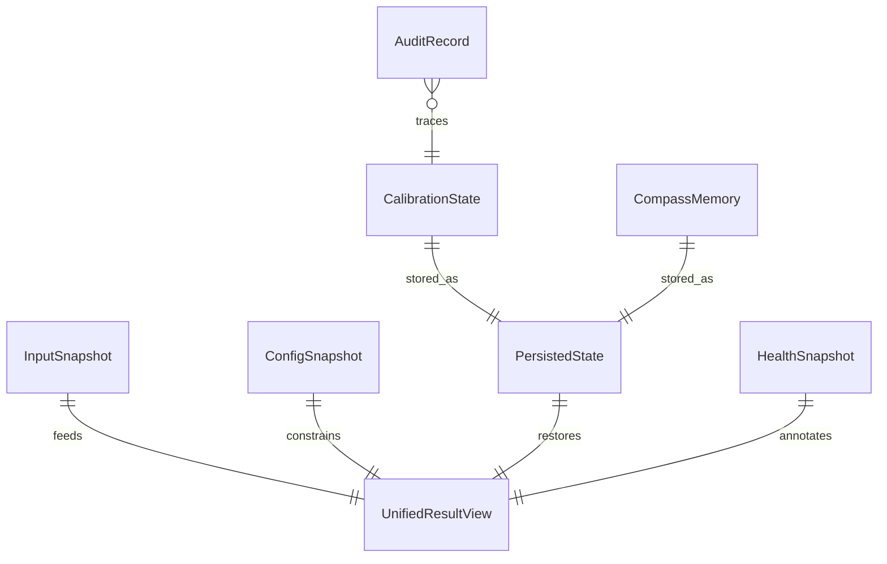
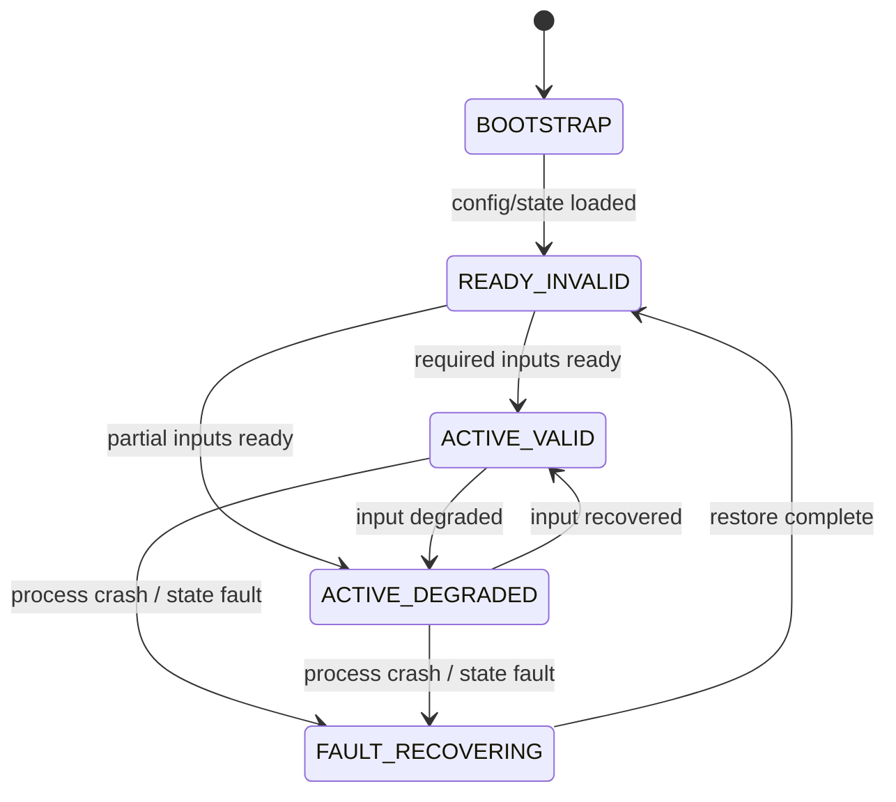

# 越野信息集成数据模型设计

Generated at: 2026-04-17

| 属性 | 内容 |
| --- | --- |
| 关联需求 | `runs/task-20260417104007-cd19df/software-requirement-orchestrator/requirements_spec.md` |
| 关联架构 | `design/architecture.md` |
| 平台 | ICC Android 单进程系统服务 |

## 1. 建模目标

1. 用统一数据模型承接 5 类输入、6 类计算能力和 12 个输出信号，避免 UI/CAN/诊断各自产生私有模型（FUN-019~FUN-022）。
2. 把清零、记忆值、恢复快照和配置版本独立建模，保证重启和异常恢复可追踪（DAT-001、DAT-002、FUN-028）。
3. 明确每个结果的有效、无效、降级三态及其来源，支撑安全输出和诊断定位（FUN-027、SAF-001、DIA-001）。

## 2. 模型总览

## 3. 核心运行时模型

### 3.1 InputSnapshot

| 字段 | 类型 | 说明 |
| --- | --- | --- |
| `imuSample` | `ImuSample?` | 最新 IMU 数据 |
| `locationSample` | `LocationSample?` | 最新定位数据 |
| `speedSample` | `SpeedSample?` | 最新车速数据 |
| `barometerSample` | `BarometerSample?` | 最新气压数据 |
| `receivedAtMs` | `long` | 快照生成时间 |
| `qualityFlags` | `map<string,string>` | 各输入源健康度 |

### 3.2 UnifiedResultView

| 字段 | 类型 | 说明 |
| --- | --- | --- |
| `publishSeq` | `long` | 单调递增发布序列 |
| `tilting` | `SignalResult<float>` | 倾斜角与有效性 |
| `pitch` | `SignalResult<float>` | 俯仰角与有效性 |
| `pressure` | `SignalResult<float>` | 大气压力与有效性 |
| `altitude` | `SignalResult<float>` | 海拔与有效性 |
| `compassDirection` | `SignalResult<string>` | 指南针方向与有效性 |
| `compassAngle` | `SignalResult<float>` | 指南针角度与有效性 |
| `overallState` | `enum` | `READY_INVALID/ACTIVE_VALID/ACTIVE_DEGRADED/FAULT_RECOVERING` |
| `updatedAtMs` | `long` | 最近更新时间 |

### 3.3 SignalResult<T>

| 字段 | 类型 | 说明 |
| --- | --- | --- |
| `value` | `T?` | 结果值 |
| `validity` | `enum` | `VALID/INVALID/DEGRADED` |
| `reasonCode` | `string` | 无效或降级原因 |
| `sourceMode` | `string` | 结果来源，如 `live`、`memory`、`baro_only` |

### 3.4 HealthSnapshot

| 字段 | 类型 | 说明 |
| --- | --- | --- |
| `serviceState` | `string` | 当前服务状态 |
| `inputAgesMs` | `map<string,long>` | 各输入源距当前的时延 |
| `restartCount` | `int` | 最近重启次数 |
| `configVersion` | `string` | 当前配置版本 |
| `lastFaultCode` | `string?` | 最近一次故障码 |

## 4. 清零、记忆值与持久化模型

### 4.1 CalibrationState

| 字段 | 类型 | 说明 |
| --- | --- | --- |
| `zeroOffsetRoll` | `float` | 倾斜角清零偏移 |
| `zeroOffsetPitch` | `float` | 俯仰角清零偏移 |
| `authState` | `enum` | `AUTHORIZED/REJECTED/PENDING` |
| `lastRequestId` | `string` | 最近一次清零请求 ID |
| `lastAppliedAtMs` | `long?` | 最近成功应用时间 |

### 4.2 CompassMemory

| 字段 | 类型 | 说明 |
| --- | --- | --- |
| `direction` | `string` | 记忆方向 |
| `angleDeg` | `float` | 记忆角度 |
| `capturedAtMs` | `long` | 存储时间 |
| `captureReason` | `string` | 如 `move_to_stop`、`boot_restore` |

### 4.3 PersistedState

| 字段 | 类型 | 说明 |
| --- | --- | --- |
| `schemaVersion` | `string` | 持久化模型版本 |
| `calibrationState` | `CalibrationState` | 清零基准 |
| `compassMemory` | `CompassMemory` | 指南针记忆值 |
| `configVersion` | `string` | 生效配置版本 |
| `persistedAtMs` | `long` | 快照写入时间 |

### 4.4 ConfigSnapshot

| 字段 | 类型 | 说明 |
| --- | --- | --- |
| `vehiclePoseProfile` | `string` | 车型姿态配置编号 |
| `imuPoseProfile` | `string` | IMU 安装姿态配置编号 |
| `featureMode` | `string` | 集成方式/启停状态 |
| `timingConfig` | `map<string,string>` | 输入超时、节拍等配置 |
| `protocolMappingVersion` | `string` | 协议映射版本 |

## 5. 审计与诊断模型

### 5.1 AuditRecord

| 字段 | 类型 | 说明 |
| --- | --- | --- |
| `auditId` | `string` | 审计记录 ID |
| `requestId` | `string` | 清零或恢复请求 ID |
| `actor` | `string` | 操作来源 |
| `stage` | `string` | `authorize/check/execute/persist/publish` |
| `resultCode` | `string` | 结果码 |
| `createdAtMs` | `long` | 事件时间 |
| `detail` | `map<string,string>` | 扩展字段 |

### 5.2 DiagnosticEvent

| 字段 | 类型 | 说明 |
| --- | --- | --- |
| `eventId` | `string` | 事件 ID |
| `eventType` | `string` | `input_fault`、`persist_fail`、`restart` 等 |
| `severity` | `string` | `INFO/WARN/ERROR` |
| `faultCode` | `string?` | 诊断码 |
| `snapshotRef` | `string?` | 关联状态快照 |

## 6. 状态机

## 7. 一致性规则

1. `UnifiedResultView` 是唯一对外发布对象，任何消费者都不得持久化私有业务状态覆盖它。
2. `PersistedState` 写入必须原子化；写失败时继续保留上一次成功版本，不更新生效指针。
3. 清零请求以 `lastRequestId` 做幂等键，重复请求只能产生一条成功结果。
4. UI 与 CAN 只能消费同一 `publishSeq` 批次结果；若任一侧发布失败，只记录发布错误，不重算结果。

*文档结束*
