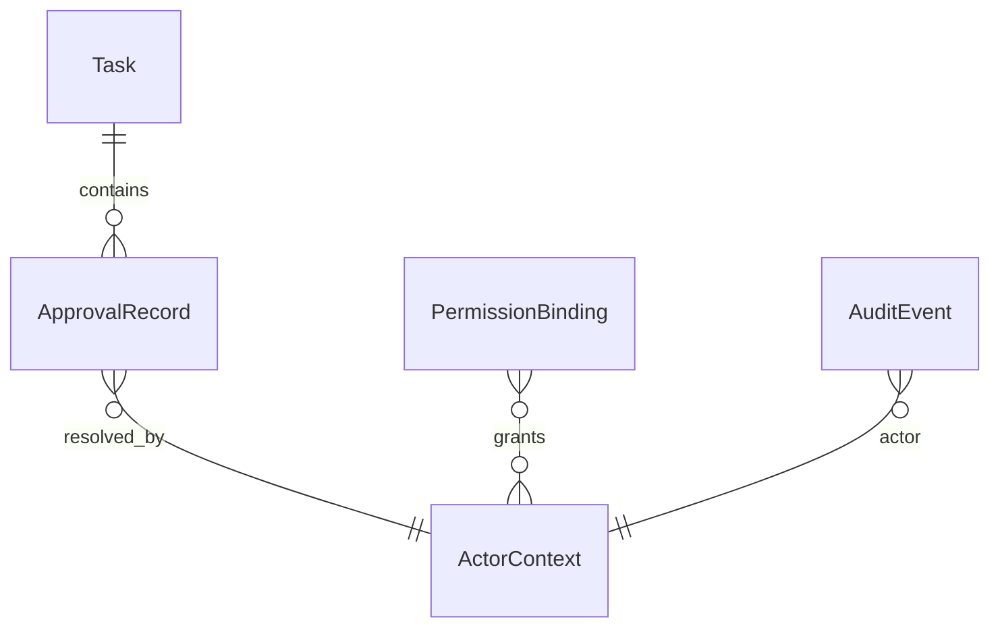
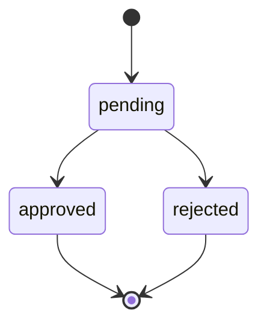

# Minimal Permission Management Data Model

Generated at: 2026-04-14

## 1. 设计目标

最小方案尽量复用现有 `task.approvals[]` 结构，不额外引入独立权限数据库。核心思路是：

1. 用轻量 `ActorContext` 表达身份。
2. 在审批记录上补齐最少审计字段。
3. 把角色配置保持为文件配置或运行时配置，避免引入复杂表结构。

---

## 2. 实体概览



---

## 3. 实体定义

### 3.1 ActorContext

运行时身份对象，不要求持久化为独立主表。

| 字段 | 类型 | 必填 | 说明 |
| --- | --- | --- | --- |
| `actor_id` | string | 是 | 唯一身份，如 `feishu:ou_xxx`、`web:alice`、`system:pipeline-runner` |
| `display_name` | string | 否 | 展示名 |
| `roles` | string[] | 是 | `requester` / `approver` / `operator` / `system` |
| `source` | string | 是 | `feishu` / `web` / `system` |
| `request_id` | string | 否 | 当前请求链路 ID |

**示例**

```json
{
  "actor_id": "feishu:ou_xxx",
  "display_name": "审批人A",
  "roles": ["approver"],
  "source": "feishu",
  "request_id": "req-8f22"
}
```

### 3.2 ApprovalRecord

在现有 `task.approvals[]` 基础上扩展。

| 字段 | 类型 | 必填 | 默认值 | 说明 |
| --- | --- | --- | --- | --- |
| `id` | string | 是 | - | 审批单 ID |
| `stage` | string | 是 | - | 触发阶段，如 `design` |
| `reason` | string | 是 | - | 触发原因 |
| `status` | enum | 是 | `pending` | `pending/approved/rejected` |
| `created_at` | datetime | 是 | now | 创建时间 |
| `required_role` | string | 是 | `approver` | 最小需要的角色 |
| `resolved_at` | datetime | 否 | null | 审批处理时间 |
| `resolved_by` | object | 否 | null | 处理人快照 |
| `resolved_roles` | string[] | 否 | [] | 处理时角色快照 |
| `resolution_channel` | string | 否 | null | `feishu/web/api` |
| `note` | string | 否 | "" | 审批备注 |

**建议 JSON 结构**

```json
{
  "id": "approval-8fa1d3c2",
  "stage": "design",
  "reason": "Risky request requires human confirmation before continuing",
  "status": "approved",
  "created_at": "2026-04-14T11:05:46Z",
  "required_role": "approver",
  "resolved_at": "2026-04-14T11:06:05Z",
  "resolved_by": {
    "actor_id": "feishu:ou_xxx",
    "display_name": "审批人A"
  },
  "resolved_roles": ["approver"],
  "resolution_channel": "feishu",
  "note": "联调批准，继续执行"
}
```

### 3.3 PermissionBinding

最小角色绑定配置，可来自 `settings` 或独立 YAML/JSON 文件。

| 字段 | 类型 | 必填 | 说明 |
| --- | --- | --- | --- |
| `actor_id` | string | 是 | 用户唯一标识 |
| `roles` | string[] | 是 | 角色列表 |
| `expires_at` | datetime | 否 | 临时授权过期时间 |
| `updated_at` | datetime | 是 | 更新时间 |
| `updated_by` | string | 是 | 更新人 |

**示例**

```json
[
  {
    "actor_id": "feishu:ou_admin_1",
    "roles": ["approver", "operator"],
    "updated_at": "2026-04-14T00:00:00Z",
    "updated_by": "system:bootstrap"
  }
]
```

### 3.4 AuditEvent

记录权限决策与审批动作。

| 字段 | 类型 | 必填 | 说明 |
| --- | --- | --- | --- |
| `id` | string | 是 | 事件 ID |
| `event_type` | string | 是 | `permission_denied` / `approval_resolve_attempt` 等 |
| `actor_id` | string | 是 | 操作人 |
| `actor_roles` | string[] | 是 | 操作角色 |
| `resource_type` | string | 是 | `approval` / `pipeline` |
| `resource_id` | string | 是 | 资源 ID |
| `action` | string | 是 | `list` / `resolve` / `control` |
| `decision` | string | 是 | `allow` / `deny` |
| `reason` | string | 否 | 拒绝原因或审批备注 |
| `created_at` | datetime | 是 | 事件时间 |
| `request_id` | string | 否 | 链路 ID |

---

## 4. Task 扩展字段

为支持“本人可读”与审计，建议在任务顶层补充以下字段：

| 字段 | 类型 | 说明 |
| --- | --- | --- |
| `created_by` | string | 任务创建人 `actor_id` |
| `created_by_name` | string | 创建人展示名 |
| `source_metadata.chat_id` | string | 来源 chat |
| `source_metadata.sender` | object/string | 原始发起人 |

**示例**

```json
{
  "id": "task-20260414110545-158a12",
  "title": "approval smoke test",
  "created_by": "feishu:ou_requester_1",
  "created_by_name": "请求人A",
  "status": "waiting_human",
  "approvals": []
}
```

---

## 5. 状态约束

### 5.1 ApprovalRecord 状态机



### 5.2 约束规则

1. `pending` 状态的审批单只允许被成功处理一次。
2. `required_role` 不能为空，默认 `approver`。
3. `resolved_by`、`resolved_at` 必须成对出现。
4. `status != pending` 后禁止再次更新为其他终态。

---

## 6. 存储策略

### 6.1 P0

- `ApprovalRecord` 继续存于 `runtime_state.json` / task artifact。
- `PermissionBinding` 存于配置文件。
- `AuditEvent` 复用现有 event bus / transcript / report 落盘。

### 6.2 P1

- 若审批规模增大，再把 `PermissionBinding`、`AuditEvent` 独立到 SQLite。

---

## 7. 最小迁移策略

1. 为历史审批记录补默认值：
   - `required_role = "approver"`
   - `resolved_roles = []`
2. 若旧记录无 `resolved_by`，保持 `null`，不做回填推断。
3. 读取逻辑必须兼容新旧结构共存。
