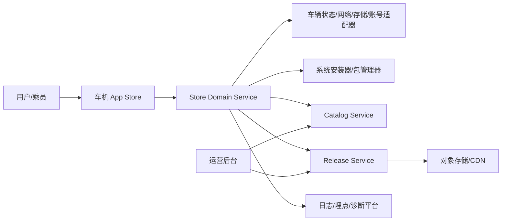
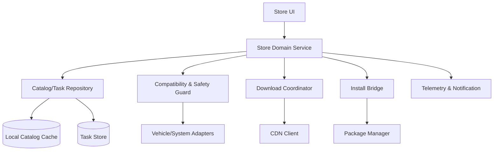
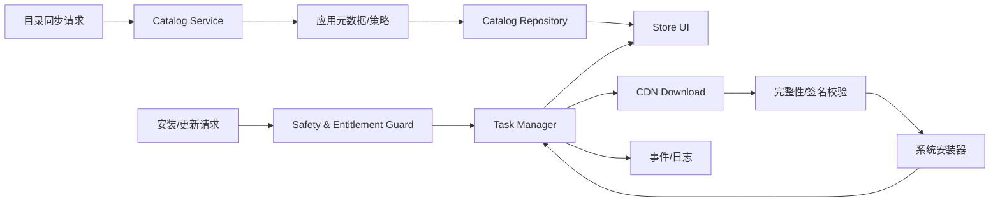
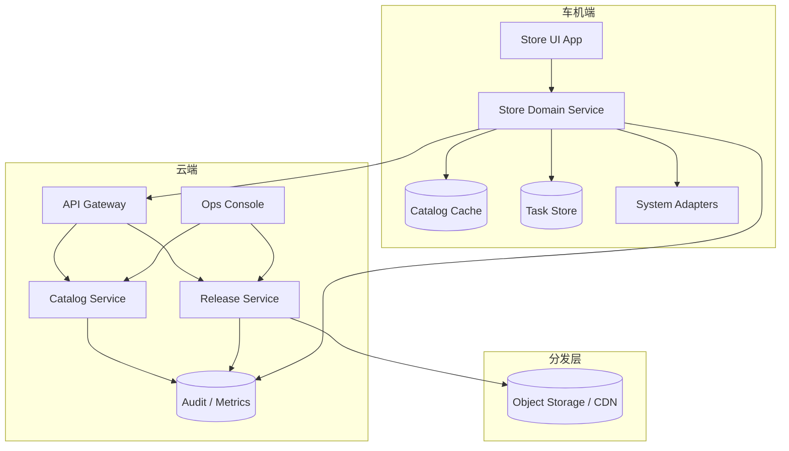
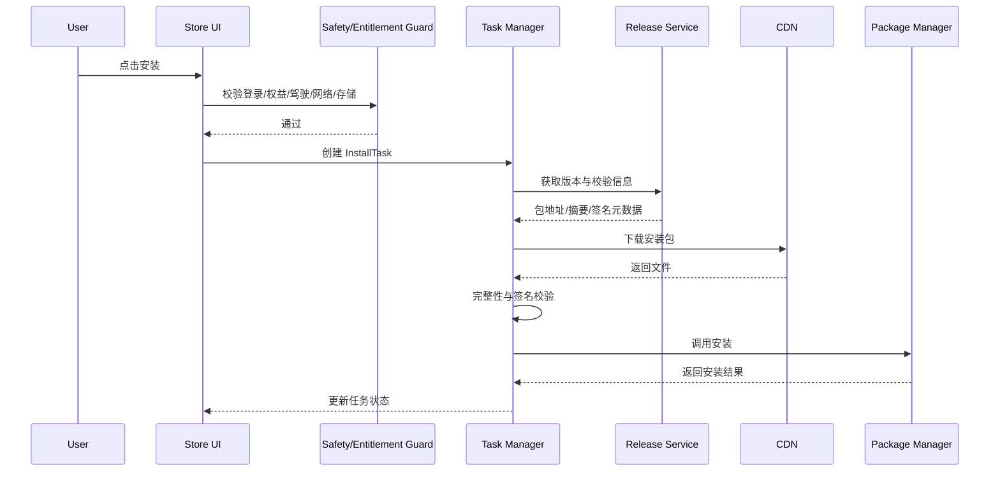

# 车机 App Store 架构设计

Generated at: 2026-04-15

| 属性 | 内容 |
| --- | --- |
| 关联需求 | `requirements/ivi_app_store_requirements_spec.md` |
| 目标平台 | Android 车机平台 / Android Automotive 类平台 |
| 方案定位 | 车机端应用商店 + 云端分发与运营平台 |
| 架构范围 | 应用目录、搜索、兼容性、下载、安装、更新、卸载、运营治理、可观测性 |

## 1. 文档概览

### 1.1 背景与目标

本方案面向车机 App Store 场景，交付端云协同的应用发现、分发、安装与治理能力。架构目标是在车机弱网、驾驶安全限制、权限和存储受限条件下，提供统一目录、单一任务事实源、可恢复下载链路和受控的应用发布治理能力，支撑需求文档中的首页、搜索、详情、安装、更新、卸载、灰度和下架等能力（FUN-001 ~ FUN-022，SEC-001，REL-002）。

### 1.2 范围与非范围

- **包含**：车机 UI、车机 Domain 服务、本地缓存、下载代理、安装桥接、兼容性评估、云端目录服务、发布服务、运营控制台、审计与指标。
- **不包含**：业务应用内部功能实现、支付与订阅闭环、第三方开发者门户、底层 Android 包管理器实现、人工内容审核制度。

### 1.3 假设与限制

- 假设目标平台具备预置安装器或系统包管理能力，允许通过受控接口触发安装与卸载（CON-001）。
- 假设车辆可提供驾驶状态、网络状态、存储空间和设备画像能力；若部分信号缺失，默认按更安全策略限制高风险动作（FUN-005，FUN-016）。
- 付费购买、评分评论、夜间自动更新窗口等范围尚未闭合，架构保留扩展点，不在首版核心链路中固化（FUN-023，FUN-024，OI-001，OI-005）。

### 1.4 名词解释

- **Store UI**：车机前台 App Store 界面层。
- **Store Domain Service**：车机端业务编排层，负责目录、任务、策略与状态协调。
- **Install Task**：安装、更新、卸载的统一任务抽象，是端侧状态单一事实源。
- **Catalog Service**：云端应用目录与检索服务。
- **Release Service**：云端安装包、版本发布、灰度与冻结能力。

## 2. 架构驱动因素

### 2.1 FR / NFR 摘要

功能面需要形成“目录 -> 详情 -> 兼容性评估 -> 下载/安装/更新/卸载 -> 状态回传 -> 运营治理”的闭环，并满足驾驶状态、账号授权、弱网恢复、重启恢复和并发冲突处理要求（FUN-002，FUN-006，FUN-010，FUN-020，FUN-021）。非功能面重点是启动可用性、下载恢复、任务一致性、安装安全、可观测性和资源受控（PERF-001，REL-001，REL-002，MNT-001，SEC-001，PLT-002）。

### 2.2 关键质量属性

1. **状态一致性**：安装、更新、卸载任务状态必须只有一个权威来源，UI 不得臆造终态（FUN-006，FUN-020）。
2. **安全性**：驾驶中受限操作、包完整性校验、签名校验和授权控制必须在安装链路前置（FUN-016，SEC-001，SEC-002）。
3. **可恢复性**：网络中断、重启、云端失败时必须可恢复或可解释（FUN-008，FUN-021，REL-003）。
4. **兼容性与治理能力**：同一应用对车型、地区、账号、OS 的分发结果必须可配置可追踪（FUN-002，FUN-014，CFG-002）。
5. **资源效率**：车机端优先使用缓存和增量同步，控制 CPU、内存、存储占用（PLT-002）。

### 2.3 主要风险与约束

- 账号与权益系统协议未明确，影响授权关系建模和登录态刷新（FUN-022，OI-004）。
- 自动更新网络策略和夜间窗口未确定，影响调度器设计（CFG-003，OI-002）。
- 资源预算、缓存容量和历史记录保留时长未量化，需通过配置化和清理策略降风险（PLT-002，OI-006）。
- 付费能力是否纳入首版未确定，订单与支付域需隔离在扩展模块中（FUN-024，OI-001）。

### 2.4 运行环境与资源预算

车机端建议采用**前台 UI + 受限后台服务 + 系统适配器**架构，控制安装链路常驻组件数量。云端采用**目录服务 + 发布服务 + 对象存储/CDN + 运营控制台**分层，轻量元数据请求与大文件下载分离。资源预算暂按以下目标设计，正式指标待产品与平台确认：

- 冷启动可见内容：展示骨架或缓存页不超过 3 秒（PERF-001）。
- 任务创建到可见状态：正常场景不超过 5 秒（PERF-002）。
- 车机端后台常驻：仅保留任务协调、通知与必要同步组件；下载数据传输不经过业务 API 代理。

## 3. 架构模式与方案选择

### 3.1 选型结论

采用 **端云分层 + 车机单一任务编排服务 + 元数据/大文件双通道隔离** 架构：

- **UI Layer**：承接首页、搜索、详情、已安装、更新、历史记录等交互。
- **Domain Layer**：负责目录聚合、兼容性决策、任务状态机、权限与安全拦截。
- **Data Layer**：负责本地缓存、任务持久化、目录同步、日志与埋点。
- **System Adapter Layer**：对接驾驶状态、账号、网络、存储、安装器、通知中心。
- **Cloud Layer**：提供目录检索、发布版本、灰度策略、签名元数据、运营管理和审计。

该方案能够满足 IVI 项目中 UI、Domain、Data、System Adapter 依赖方向清晰、轻量请求与大文件传输隔离、安装状态单一事实源的要求。

### 3.2 备选架构评估

| 方案 | 优点 | 缺点 | 结论 |
| --- | --- | --- | --- |
| 车机前端直连所有云端能力 | 实现快、链路短 | 兼容性、策略、审计能力分散；难统一治理 | 不选 |
| 车机端强离线本地仓库 | 弱网体验好 | 首次分发成本高，运营灵活性差，包更新成本高 | 不选 |
| **车机编排服务 + 云端目录/发布中心** | 状态统一、治理清晰、便于灰度与审计 | 需要端云协议和缓存策略设计 | **选用** |

### 3.3 演进路径

1. **P0**：支持免费应用目录、安装、更新、卸载、灰度、下架和埋点。
2. **P1**：补充评分评论、账号权益增强、自动更新策略和更细粒度资源调度。
3. **P2**：若引入付费能力，新增订单/支付子域，但保持 `Entitlement` 对安装域的统一接口不变。

## 4. 架构全景图

### 4.1 系统上下文图

### 4.2 模块图 / 容器图

### 4.3 数据流图

### 4.4 部署架构图

### 4.5 关键动态行为

## 5. 模块划分与职责边界

| 模块 | 职责 | 公开接口 | 依赖 | 数据归属 | 禁止事项 |
| --- | --- | --- | --- | --- | --- |
| Store UI | 首页、搜索、详情、我的应用、更新中心、历史记录 | ViewModel / UI Action | Domain Service | 仅持有渲染态 | 不直接调用安装器和 CDN |
| Store Domain Service | 编排目录、任务、安全策略和通知 | UseCase / IPC API | Repository、Policy、Downloader、InstallerBridge | 任务状态单一事实源 | 不直接持久化 UI 临时态 |
| Compatibility & Safety Guard | 车型、区域、账号、驾驶、网络、存储拦截 | `evaluateVisibility` `evaluateAction` | Vehicle/System Adapters | 只持有规则快照 | 不直接修改任务终态 |
| Catalog Repository | 目录同步、本地缓存、搜索索引 | `syncCatalog` `queryApps` | Cloud API、Cache | 目录与版本快照 | 不承接安装逻辑 |
| Task Manager | 安装/更新/卸载状态机、恢复、冲突处理 | `createTask` `resumeTask` `cancelTask` | Downloader、InstallerBridge、Task Store | InstallTask | 不绕过 Guard |
| Download Coordinator | 下载、断点续传、进度上报 | `startDownload` `resumeDownload` | CDN Client | 下载临时文件 | 不决定可安装性 |
| Install Bridge | 复用系统安装器执行安装/卸载 | `installPackage` `uninstallPackage` | Package Manager | 安装结果快照 | 不保存业务目录数据 |
| Cloud Catalog Service | 提供目录、搜索、推荐、兼容性规则 | REST API | Catalog DB、Search Index | 应用元数据 | 不传输大文件 |
| Cloud Release Service | 版本、灰度、冻结、校验元数据 | REST API | Release DB、CDN | 版本与发布策略 | 不承接 UI 聚合 |
| Ops Console | 运营配置、上架、下架、推荐位、灰度配置 | Web UI / Admin API | Catalog/Release Service | 运维审计记录 | 不直接改车机本地状态 |

## 6. 数据模型与状态流转

### 6.1 核心实体

- `AppListing`：应用展示主实体，聚合基础信息、当前推荐状态与可见性摘要（FUN-001，FUN-004）。
- `AppRelease`：可分发版本实体，包含版本号、包摘要、包大小、签名信息、灰度与冻结状态（FUN-014，SEC-001）。
- `CompatibilityRule`：车型、地区、账号、OS、屏幕与驾驶状态相关规则（FUN-002，CFG-002）。
- `InstallTask`：安装、更新、卸载统一任务实体，是端侧事实源（FUN-006，FUN-010，FUN-021）。
- `EntitlementSnapshot`：账号与车辆的应用授权快照（FUN-005，FUN-022）。

### 6.2 关系与约束

- 一个 `AppListing` 可关联多个 `AppRelease`，但同一设备在任一时刻只允许一个候选目标版本处于“推荐安装”状态。
- 一个 `InstallTask` 只对应一个 `appId + releaseId + actionType` 组合；同一组合存在活动任务时，不得新建冲突任务（FUN-007）。
- `CompatibilityRule` 与 `EntitlementSnapshot` 共同决定最终 `AvailabilityDecision`，且 `SafetyRestriction` 优先级最高（FUN-020）。

### 6.3 状态机 / 生命周期

`InstallTask` 建议状态：

`created -> waiting_precheck -> downloading -> verifying -> installing -> succeeded`

失败支路：

`downloading/verifying/installing -> failed`

恢复支路：

`downloading -> paused -> downloading`

重启支路：

`downloading/installing -> restoring -> downloading/installing/failed`

### 6.4 一致性要求

- UI 展示状态只读取 `InstallTask` 和 `AvailabilityDecision`，不直接根据按钮点击推断成功或失败。
- 目录缓存与任务状态分离存储；目录同步失败不影响进行中安装任务（REL-001）。
- 下架事件到达时，新任务立即阻断；已完成安装的应用仅改变“可更新/可重新安装”状态，不主动卸载（FUN-013）。

## 7. 接口与集成设计

### 7.1 接口风格与通信方式

- 车机与云端元数据交互使用 HTTPS JSON API。
- 安装包下载使用对象存储/CDN 直传，避免通过业务服务中转大文件。
- 车机内部 UI 与 Domain Service 采用进程内调用或受控 IPC。

### 7.2 请求 / 响应模型

- 目录请求带设备画像、地区、客户端版本、账号摘要。
- 任务创建请求带 `appId`、`releaseId`、`actionType`、发起上下文。
- 响应统一返回 `requestId`、稳定错误码、可重试标识和用户提示文案键。

### 7.3 错误码、幂等性、超时与重试

- 任务创建接口以 `appId + releaseId + actionType + actorContext` 作为幂等键候选。
- 目录接口超时不影响本地缓存读取；任务接口失败须返回稳定错误码，如 `NO_NETWORK`、`LOW_STORAGE`、`DRIVING_RESTRICTED`、`SIGNATURE_INVALID`。
- 下载失败按配置重试；安装失败不自动重试，避免重复触发系统安装器。

### 7.4 外部系统集成策略

- **账号系统**：提供登录态、用户标识和授权令牌；若账号退出，则触发 `EntitlementSnapshot` 失效与目录重算。
- **车辆状态系统**：提供驾驶状态、存储空间、网络与设备画像，用于前置拦截。
- **安装器/包管理器**：执行实际安装卸载，并返回系统结果码。
- **分析平台**：接收曝光、点击、任务状态和失败事件。

## 8. 安全设计

### 8.1 认证与授权

- 云端 API 使用设备认证 + 用户认证组合；未登录时仅允许访问公开目录和公开详情。
- 安装动作必须同时通过登录态/权益校验和车辆安全校验（SEC-002，SAF-001）。
- 运营后台采用 RBAC，区分运营、审核、发布、只读审计角色。

### 8.2 敏感数据保护

- 账号 ID、设备 ID、VIN 等敏感字段在日志和埋点中脱敏。
- 安装包签名信息只作为校验元数据使用，不在前台界面暴露底层证书细节。

### 8.3 输入校验与攻击面防护

- 车机端所有任务创建都必须经过参数校验，禁止空 `appId`、非法版本组合或伪造状态跳转。
- 云端目录与发布接口需校验运营输入，防止非法推荐位、错误兼容性配置和越权发布。
- CDN 下载完成后必须二次校验哈希与签名，避免中间人替换或缓存污染（SEC-001）。

### 8.4 审计与追踪

- 运营侧上下架、冻结、灰度变更生成审计记录。
- 端侧安装失败、策略拒绝和恢复动作生成审计事件并带 `requestId`、`taskId`、`appId`。

## 9. 可观测性设计

### 9.1 日志

- 关键日志覆盖目录同步、兼容性决策、任务状态切换、下载重试、校验失败、安装器结果和策略拒绝（MNT-001）。

### 9.2 指标

- 首页可见耗时、详情加载耗时、任务创建耗时、下载成功率、安装成功率、恢复成功率、下架生效率。

### 9.3 链路追踪

- 目录请求、任务创建与状态回传统一携带 `requestId` 和 `taskId`。
- 云端发布变更携带 `releaseId` 与 `policyVersion`，便于关联端侧表现。

### 9.4 告警与诊断

- 连续目录同步失败、安装失败率异常、签名校验失败率异常、下架策略未生效等触发告警。
- 车机端提供最近同步时间、目录版本、策略版本、任务结果和错误码诊断入口（MNT-003，DIA-001）。

## 10. 部署、发布与演进

### 10.1 部署方案

- 车机端以预置系统应用或 OEM 签名应用部署。
- 云端按 `Gateway + Catalog Service + Release Service + CDN + Ops Console` 拆分部署。

### 10.2 灰度、回滚与兼容策略

- 通过 `Release Service` 维护灰度范围、冻结规则和撤回开关（FUN-014）。
- 目录与版本元数据支持版本号和策略版本；端侧同步失败时保留上一个稳定快照。
- 对已发布错误版本可通过冻结 + 下架 + 端侧停止推荐组合实现快速止血。

### 10.3 演进路线图

1. 完成免费应用闭环与核心任务状态机。
2. 补充自动更新、评论评分和更细分推荐运营能力。
3. 在需求闭合后再引入订单、支付和开发者门户子域。

## 11. 风险与待确认项

| 编号 | 风险/待确认项 | 影响 | 应对策略 |
| --- | --- | --- | --- |
| R1 | 账号与权益接口协议未定 | 影响授权和目录过滤正确性 | 以 `EntitlementSnapshot` 适配层隔离 |
| R2 | 自动更新网络与时间窗口未定 | 影响调度器实现与用户体验 | 先以配置开关和默认关闭控制 |
| R3 | 资源预算未正式给出 | 影响缓存和后台服务设计 | 采用轻量常驻、可配置缓存和淘汰策略 |
| R4 | 付费能力是否进入首版未定 | 影响订单域范围与接口 | 将订单域完全独立为后续扩展模块 |
