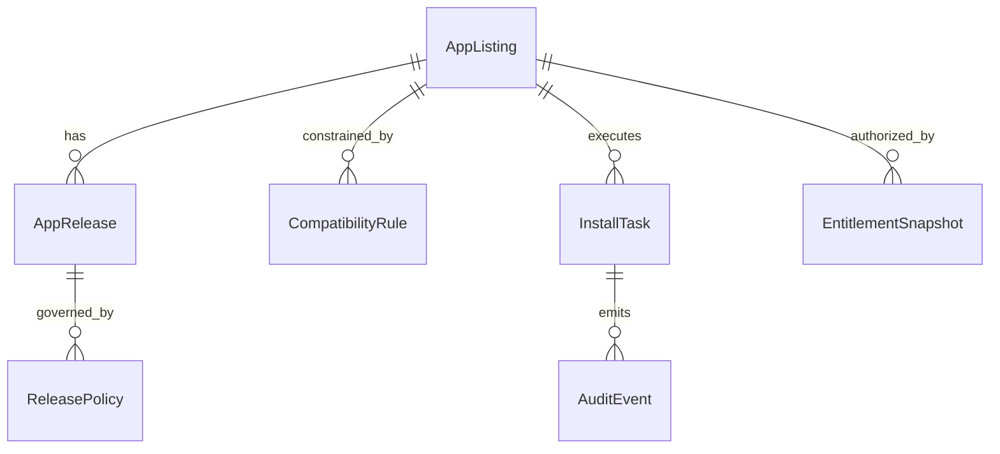
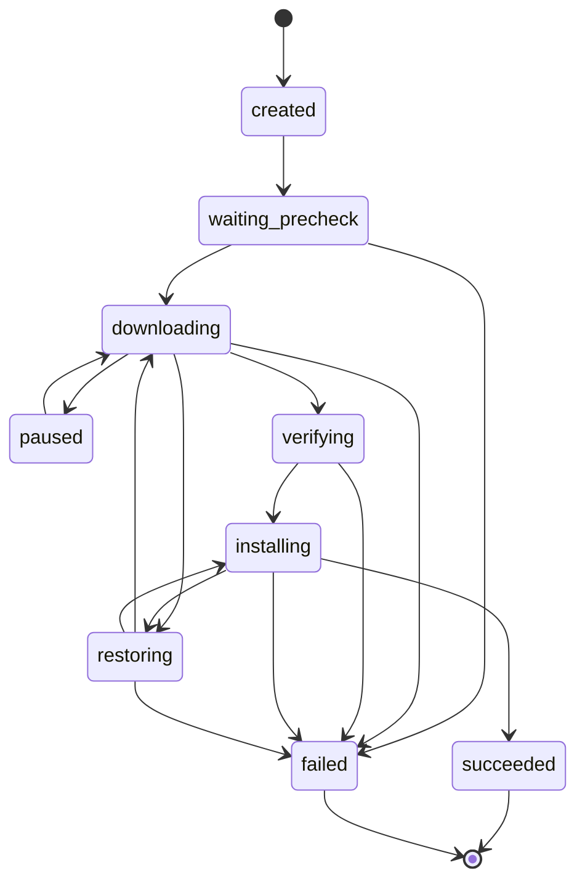

# 车机 App Store 数据模型设计文档

## 1. 概览

### 1.1 建模范围

本文档定义车机 App Store 的核心数据实体，覆盖应用目录、版本发布、兼容性规则、任务状态、授权快照和运营审计。建模范围同时覆盖车机端持久化数据与云端主数据边界，确保需求、架构与 API 使用同一套术语。

### 1.2 一致性原则

1. `InstallTask` 是端侧安装、更新、卸载状态的单一事实源。
2. `AppListing` 与 `AppRelease` 分离，避免 UI 元数据与发布元数据相互污染。
3. `CompatibilityRule`、`EntitlementSnapshot` 与 `SafetyRestriction` 共同生成 `AvailabilityDecision`，其中安全限制优先级最高。
4. 下架、冻结、灰度等治理动作通过 `ReleasePolicy` 建模，不直接修改历史任务记录。

## 2. 实体定义

### 2.1 AppListing

- 需求追溯：FUN-001、FUN-003、FUN-004、DAT-001
- 描述：应用展示主实体。

| 字段 | 类型 | 必填 | 默认值 | 说明 |
|------|------|------|--------|------|
| `app_id` | string | 是 | - | 应用唯一标识 |
| `name` | string | 是 | - | 应用名称 |
| `developer_name` | string | 是 | - | 开发方 |
| `category` | string | 是 | - | 分类编码 |
| `summary` | string | 是 | - | 简介 |
| `icon_url` | string | 否 | null | 图标地址 |
| `detail_media` | json | 否 | [] | 截图/视频摘要 |
| `rating_summary` | json | 否 | null | 评分摘要，[待确认] |
| `status` | enum | 是 | `active` | `active/removed/hidden` |
| `latest_release_id` | string | 否 | null | 默认推荐版本 |
| `updated_at` | datetime | 是 | now | 最近更新时间 |

### 2.2 AppRelease

- 需求追溯：FUN-006、FUN-009、FUN-014、SEC-001、CMP-001
- 描述：可分发版本实体。

| 字段 | 类型 | 必填 | 默认值 | 说明 |
|------|------|------|--------|------|
| `release_id` | string | 是 | - | 版本发布 ID |
| `app_id` | string | 是 | - | 关联应用 |
| `version_name` | string | 是 | - | 版本号 |
| `version_code` | integer | 是 | - | 版本编码 |
| `package_uri` | string | 是 | - | 安装包下载地址 |
| `package_size_bytes` | integer | 是 | - | 包大小 |
| `sha256` | string | 是 | - | 完整性摘要 |
| `signature_digest` | string | 是 | - | 签名摘要 |
| `release_status` | enum | 是 | `draft` | `draft/approved/published/frozen/revoked` |
| `rollout_policy_id` | string | 否 | null | 灰度策略 |
| `published_at` | datetime | 否 | null | 发布时间 |

### 2.3 CompatibilityRule

- 需求追溯：FUN-002、CFG-002、FUN-020
- 描述：应用可见性与可安装性规则。

| 字段 | 类型 | 必填 | 默认值 | 说明 |
|------|------|------|--------|------|
| `rule_id` | string | 是 | - | 规则 ID |
| `app_id` | string | 是 | - | 关联应用 |
| `match_vehicle_models` | string[] | 否 | [] | 允许车型 |
| `match_regions` | string[] | 否 | [] | 允许区域 |
| `min_os_version` | string | 否 | null | 最低系统版本 |
| `max_os_version` | string | 否 | null | 最高系统版本 |
| `required_screen_class` | string | 否 | null | 屏幕规格 |
| `requires_parked` | boolean | 是 | false | 是否必须驻车 |
| `requires_login` | boolean | 是 | false | 是否需要登录 |
| `decision_if_miss` | enum | 是 | `hidden` | `hidden/restricted` |
| `updated_at` | datetime | 是 | now | 更新时间 |

### 2.4 EntitlementSnapshot

- 需求追溯：FUN-005、FUN-022、SEC-002
- 描述：账号和车辆维度的授权快照。

| 字段 | 类型 | 必填 | 默认值 | 说明 |
|------|------|------|--------|------|
| `snapshot_id` | string | 是 | - | 快照 ID |
| `user_id` | string | 否 | null | 用户标识 |
| `device_id` | string | 是 | - | 设备标识 |
| `app_id` | string | 是 | - | 应用标识 |
| `entitlement_status` | enum | 是 | `denied` | `granted/denied/expired` |
| `source` | string | 是 | - | 来源系统 |
| `expires_at` | datetime | 否 | null | 过期时间 |
| `updated_at` | datetime | 是 | now | 更新时间 |

### 2.5 InstallTask

- 需求追溯：FUN-006、FUN-007、FUN-008、FUN-010、FUN-021、DAT-002
- 描述：端侧任务实体。

| 字段 | 类型 | 必填 | 默认值 | 说明 |
|------|------|------|--------|------|
| `task_id` | string | 是 | - | 任务 ID |
| `app_id` | string | 是 | - | 应用标识 |
| `release_id` | string | 否 | null | 目标版本 |
| `action_type` | enum | 是 | - | `install/update/uninstall` |
| `status` | enum | 是 | `created` | 任务状态 |
| `progress` | integer | 是 | 0 | 0-100 |
| `retry_count` | integer | 是 | 0 | 下载重试次数 |
| `error_code` | string | 否 | null | 失败错误码 |
| `error_message_key` | string | 否 | null | 前台文案键 |
| `resume_token` | string | 否 | null | 断点续传信息 |
| `created_at` | datetime | 是 | now | 创建时间 |
| `updated_at` | datetime | 是 | now | 更新时间 |
| `actor_context` | json | 是 | - | 发起人上下文 |

### 2.6 AvailabilityDecision

- 需求追溯：FUN-002、FUN-005、FUN-016、FUN-020
- 描述：当前设备对某应用的可见/可安装决策结果。

| 字段 | 类型 | 必填 | 默认值 | 说明 |
|------|------|------|--------|------|
| `app_id` | string | 是 | - | 应用标识 |
| `release_id` | string | 否 | null | 候选版本 |
| `visibility` | enum | 是 | `hidden` | `hidden/visible` |
| `actionability` | enum | 是 | `blocked` | `installable/updatable/blocked/installed` |
| `reason_code` | string | 否 | null | 原因码，如 `DRIVING_RESTRICTED` |
| `policy_version` | string | 是 | - | 决策所用策略版本 |
| `generated_at` | datetime | 是 | now | 生成时间 |

### 2.7 ReleasePolicy

- 需求追溯：FUN-013、FUN-014、CFG-004
- 描述：发布治理规则。

| 字段 | 类型 | 必填 | 默认值 | 说明 |
|------|------|------|--------|------|
| `policy_id` | string | 是 | - | 策略 ID |
| `release_id` | string | 是 | - | 关联版本 |
| `policy_type` | enum | 是 | - | `rollout/freeze/blacklist/whitelist/remove` |
| `scope` | json | 是 | {} | 区域、车型、账号范围 |
| `effective_at` | datetime | 是 | - | 生效时间 |
| `expired_at` | datetime | 否 | null | 失效时间 |
| `operator_id` | string | 是 | - | 操作人 |
| `audit_ref` | string | 是 | - | 审计记录引用 |

### 2.8 AuditEvent

- 需求追溯：FUN-019、MNT-001、MNT-002、DIA-001
- 描述：端云审计与诊断事件。

| 字段 | 类型 | 必填 | 默认值 | 说明 |
|------|------|------|--------|------|
| `event_id` | string | 是 | - | 事件 ID |
| `event_type` | string | 是 | - | 事件类型 |
| `app_id` | string | 否 | null | 应用标识 |
| `release_id` | string | 否 | null | 版本标识 |
| `task_id` | string | 否 | null | 任务标识 |
| `actor_id` | string | 否 | null | 操作者 |
| `request_id` | string | 否 | null | 链路 ID |
| `payload` | json | 否 | {} | 扩展字段 |
| `created_at` | datetime | 是 | now | 事件时间 |

## 3. 实体关系

1. `AppListing 1 --- n AppRelease`
2. `AppListing 1 --- n CompatibilityRule`
3. `AppRelease 1 --- n ReleasePolicy`
4. `AppListing 1 --- n InstallTask`
5. `AppListing 1 --- n EntitlementSnapshot`
6. `InstallTask 1 --- n AuditEvent`

## 4. Mermaid ER 图

## 5. 状态机与状态流转

### 5.1 InstallTask 状态机

### 5.2 ReleasePolicy 生效规则

1. `remove` 与 `freeze` 优先级高于 `rollout`。
2. `blacklist` 高于 `whitelist`，[待确认] 是否允许特定车型白名单覆盖全局黑名单。
3. `requires_parked` 属于运行时安全限制，不写回 `AppRelease` 主状态。

## 6. 索引、约束与校验规则

1. `AppListing.app_id` 唯一。
2. `AppRelease(app_id, version_code)` 唯一。
3. `InstallTask` 对活动任务增加唯一约束候选：`app_id + release_id + action_type + active_status`。
4. `AvailabilityDecision` 只做运行时派生，可缓存但不可手工编辑。
5. `AuditEvent.event_id` 必须可用于去重，支持批量上报幂等。

## 7. 数据生命周期

| 实体 | 生命周期 | 存储位置 |
|------|----------|----------|
| `AppListing` | 随目录同步更新，失效后可被替换 | 云端主存储 + 车机缓存 |
| `AppRelease` | 随发布流程推进，冻结/撤回后保留历史 | 云端主存储 |
| `CompatibilityRule` | 策略变更即更新，端侧保留最近快照 | 云端主存储 + 车机缓存 |
| `EntitlementSnapshot` | 登录态或授权变化时刷新 | 车机短期缓存 |
| `InstallTask` | 创建后持续到终态，历史可定期清理 | 车机持久化 |
| `AuditEvent` | 生成后上传并按审计周期保留 | 车机缓冲 + 云端审计 |

## 8. 待确认项

1. 是否需要持久化评分评论实体。
2. 订单与支付能力若纳入首版，需新增 `Order`、`PaymentAttempt`、`SubscriptionEntitlement`。
3. 历史任务和审计事件的端侧保留时长、容量上限尚未确定。
