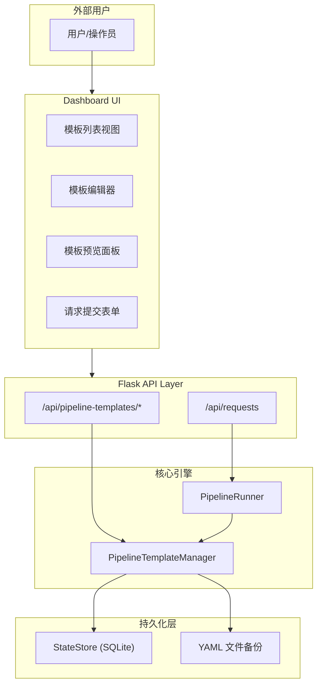
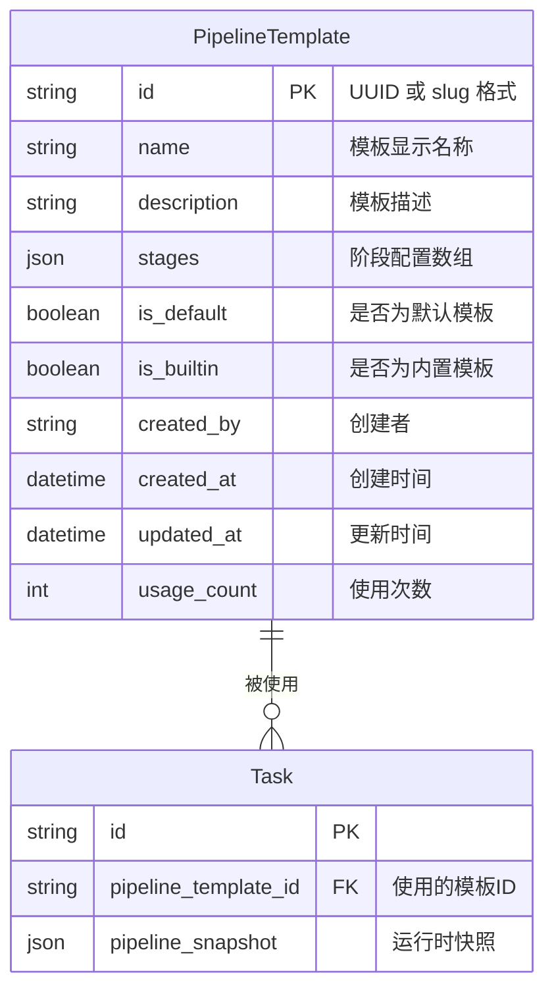
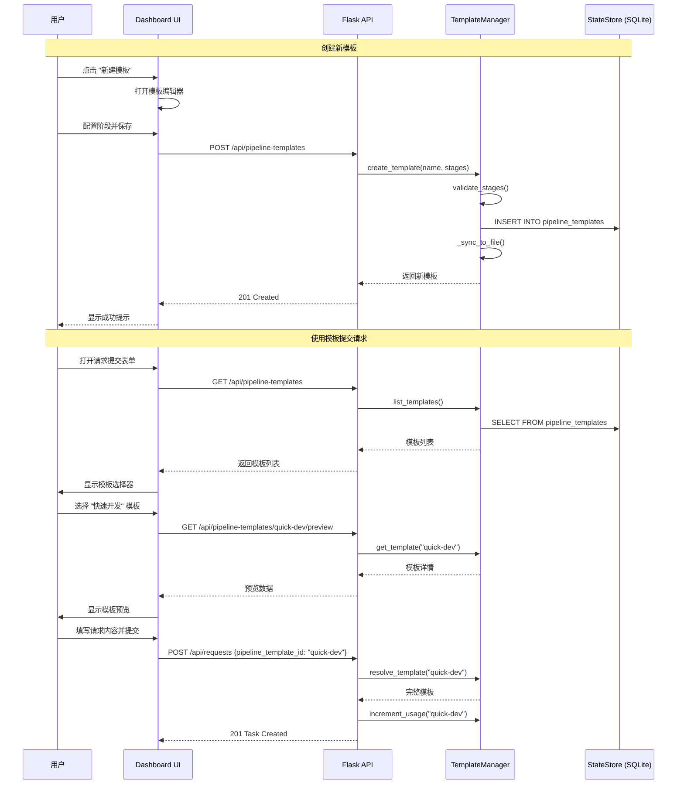
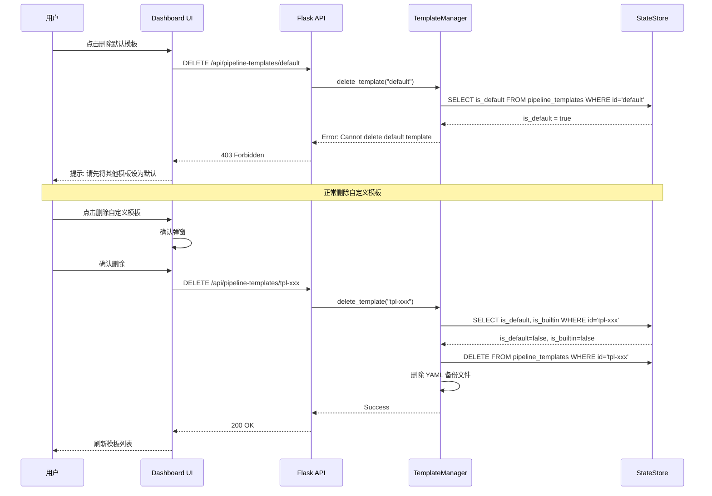

# Pipeline Template Management System Design

Generated at: 2026-04-11

## 1. 概述

本设计文档定义了 Harness 编排系统的 Pipeline 模板管理功能，支持用户自定义创建、编辑、保存、预览和删除 Pipeline 编排模板，并在提交新请求时选择使用哪个模板。

### 1.1 需求摘要

| 需求ID | 描述 | 优先级 |
|--------|------|--------|
| PTM-001 | 用户可以编辑和保存 Pipeline 编排，指定名称 | P0 |
| PTM-002 | Pipeline 模板持久化到数据库或文件 | P0 |
| PTM-003 | 系统启动时自动加载已保存的 Pipeline 模板 | P0 |
| PTM-004 | 用户可以预览已存在的 Pipeline 模板列表 | P0 |
| PTM-005 | 提交请求前用户可以选择已有的 Pipeline 模板 | P0 |
| PTM-006 | 未选择模板时使用默认 Pipeline | P0 |
| PTM-007 | 用户可以更新默认模板设置 | P1 |
| PTM-008 | 选择模板时可预览模板详情，避免选错 | P1 |
| PTM-009 | 用户可以删除无用的 Pipeline 模板 | P1 |
| PTM-010 | 系统必须保留至少一个默认 Pipeline | P0 |

---

## 2. 系统架构

### 2.1 C4 组件图



### 2.2 模板生命周期状态图

```mermaid
stateDiagram-v2
    [*] --> Draft: 用户创建新模板
    Draft --> Active: 保存模板
    Active --> Active: 编辑更新
    Active --> Default: 设为默认
    Default --> Active: 取消默认
    Active --> Archived: 删除模板
    Default --> [*]: 不可删除（保护）
    Archived --> [*]
    
    note right of Default
        系统必须保留至少一个默认模板
        默认模板不可删除
    end note
```

---

## 3. 数据模型

### 3.1 ER 图



### 3.2 PipelineTemplate 实体详细定义

| 字段 | 类型 | 必填 | 默认值 | 约束 | 说明 |
|------|------|------|--------|------|------|
| `id` | string | 是 | UUID | PK, unique | 模板唯一标识符，支持 `default`、`full-review`、`quick-dev` 等语义化 slug |
| `name` | string | 是 | - | 1-100 chars | 用户可见的模板名称 |
| `description` | string | 否 | "" | 0-500 chars | 模板描述，说明适用场景 |
| `stages` | json | 是 | - | array | 阶段配置，结构见下文 |
| `is_default` | boolean | 否 | false | 最多一个为 true | 是否为默认模板 |
| `is_builtin` | boolean | 否 | false | 内置模板不可删除 | 是否为系统内置模板 |
| `created_by` | string | 否 | "system" | - | 创建者标识 |
| `created_at` | datetime | 是 | now() | ISO8601 | 创建时间 |
| `updated_at` | datetime | 是 | now() | ISO8601 | 最后更新时间 |
| `usage_count` | int | 否 | 0 | >= 0 | 被任务使用的次数 |

### 3.3 Stage 配置结构

```yaml
stages:
  - id: "intake"              # 阶段唯一标识
    name: "Request Intake"    # 阶段显示名称
    agent: "planner"          # 执行该阶段的 Agent ID
    enabled: true             # 是否启用（可选，默认 true）
    skip_conditions: []       # 跳过条件（保留字段）
    timeout_seconds: 1800     # 超时时间（可选）
    retry_limit: 3            # 重试次数（可选）
```

### 3.4 内置模板定义

系统预置以下模板：

```yaml
# 1. 完整流程模板 (default)
- id: default
  name: "完整流程"
  description: "包含从需求分析到构建验证的完整 pipeline，适用于正式需求"
  is_default: true
  is_builtin: true
  stages:
    - { id: intake, name: Request Intake, agent: planner }
    - { id: planning, name: Sprint Planning, agent: planner }
    - { id: requirements, name: Requirements, agent: requirements-analyst }
    - { id: design, name: System Design, agent: system-architect }
    - { id: development, name: Implementation, agent: developer }
    - { id: code_review, name: Code Review, agent: code-reviewer }
    - { id: security_review, name: Security Review, agent: security-reviewer }
    - { id: safety_review, name: Safety Review, agent: safety-reviewer }
    - { id: testing, name: Unit Testing, agent: unite-test }
    - { id: delivery, name: Gerrit Delivery, agent: delivery-manager }
    - { id: build_verification, name: Build Verification, agent: build-verifier }

# 2. 快速开发模板
- id: quick-dev
  name: "快速开发"
  description: "跳过设计和安全审查，适用于小型代码修改或 bug 修复"
  is_builtin: true
  stages:
    - { id: intake, name: Request Intake, agent: planner }
    - { id: development, name: Implementation, agent: developer }
    - { id: code_review, name: Code Review, agent: code-reviewer }
    - { id: testing, name: Unit Testing, agent: unite-test }

# 3. 仅设计模板
- id: design-only
  name: "仅设计"
  description: "只进行需求分析和架构设计，不进行开发实现"
  is_builtin: true
  stages:
    - { id: intake, name: Request Intake, agent: planner }
    - { id: planning, name: Sprint Planning, agent: planner }
    - { id: requirements, name: Requirements, agent: requirements-analyst }
    - { id: design, name: System Design, agent: system-architect }

# 4. 车载中间件专用模板
- id: cockpit-middleware
  name: "车载中间件流程"
  description: "针对 IVI/座舱中间件的完整流程，包含安全审查"
  is_builtin: true
  stages:
    - { id: intake, name: Request Intake, agent: planner }
    - { id: requirements, name: Requirements, agent: requirements-analyst }
    - { id: cockpit-middleware-architect, name: Cockpit Middleware Architect, agent: cockpit-middleware-architect }
    - { id: development, name: Implementation, agent: developer }
    - { id: code_review, name: Code Review, agent: code-reviewer }
    - { id: security_review, name: Security Review, agent: security-reviewer }
    - { id: safety_review, name: Safety Review, agent: safety-reviewer }
    - { id: testing, name: Unit Testing, agent: unite-test }
```

---

## 4. API 设计

### 4.1 API 端点总览

| 方法 | 路径 | 描述 |
|------|------|------|
| GET | `/api/pipeline-templates` | 获取所有模板列表（含预览信息） |
| GET | `/api/pipeline-templates/:id` | 获取单个模板详情 |
| POST | `/api/pipeline-templates` | 创建新模板 |
| PUT | `/api/pipeline-templates/:id` | 更新模板 |
| DELETE | `/api/pipeline-templates/:id` | 删除模板 |
| POST | `/api/pipeline-templates/:id/set-default` | 设为默认模板 |
| GET | `/api/pipeline-templates/:id/preview` | 预览模板可视化 |

### 4.2 详细 API 定义

#### 4.2.1 GET /api/pipeline-templates

获取所有模板列表，用于选择器和管理界面。

**Response 200:**
```json
{
  "templates": [
    {
      "id": "default",
      "name": "完整流程",
      "description": "包含从需求分析到构建验证的完整 pipeline",
      "is_default": true,
      "is_builtin": true,
      "stage_count": 11,
      "stage_ids": ["intake", "planning", "requirements", "design", "development", "code_review", "security_review", "safety_review", "testing", "delivery", "build_verification"],
      "usage_count": 42,
      "created_at": "2026-04-01T00:00:00Z",
      "updated_at": "2026-04-01T00:00:00Z"
    },
    {
      "id": "quick-dev",
      "name": "快速开发",
      "description": "跳过设计和安全审查，适用于小型代码修改",
      "is_default": false,
      "is_builtin": true,
      "stage_count": 4,
      "stage_ids": ["intake", "development", "code_review", "testing"],
      "usage_count": 15,
      "created_at": "2026-04-01T00:00:00Z",
      "updated_at": "2026-04-01T00:00:00Z"
    }
  ],
  "default_id": "default"
}
```

#### 4.2.2 GET /api/pipeline-templates/:id

获取单个模板的完整详情。

**Response 200:**
```json
{
  "id": "default",
  "name": "完整流程",
  "description": "包含从需求分析到构建验证的完整 pipeline",
  "is_default": true,
  "is_builtin": true,
  "stages": [
    { "id": "intake", "name": "Request Intake", "agent": "planner" },
    { "id": "planning", "name": "Sprint Planning", "agent": "planner" }
  ],
  "usage_count": 42,
  "created_by": "system",
  "created_at": "2026-04-01T00:00:00Z",
  "updated_at": "2026-04-01T00:00:00Z"
}
```

**Response 404:**
```json
{ "error": "Template not found" }
```

#### 4.2.3 POST /api/pipeline-templates

创建新模板。

**Request:**
```json
{
  "name": "我的自定义流程",
  "description": "适用于特定项目的自定义流程",
  "stages": [
    { "id": "intake", "name": "Request Intake", "agent": "planner" },
    { "id": "development", "name": "Implementation", "agent": "developer" },
    { "id": "testing", "name": "Unit Testing", "agent": "unite-test" }
  ],
  "set_as_default": false
}
```

**Response 201:**
```json
{
  "id": "tpl-20260411-abc123",
  "name": "我的自定义流程",
  "message": "Template created successfully"
}
```

**Response 400:**
```json
{ "error": "name is required" }
```

#### 4.2.4 PUT /api/pipeline-templates/:id

更新已有模板。

**Request:**
```json
{
  "name": "更新后的名称",
  "description": "更新后的描述",
  "stages": [...]
}
```

**Response 200:**
```json
{
  "id": "tpl-20260411-abc123",
  "message": "Template updated successfully"
}
```

**Response 403:**
```json
{ "error": "Cannot modify builtin template stages, only name and description" }
```

#### 4.2.5 DELETE /api/pipeline-templates/:id

删除模板。

**Response 200:**
```json
{
  "id": "tpl-20260411-abc123",
  "message": "Template deleted successfully"
}
```

**Response 403:**
```json
{ "error": "Cannot delete the default template. Set another template as default first." }
```

```json
{ "error": "Cannot delete builtin template" }
```

#### 4.2.6 POST /api/pipeline-templates/:id/set-default

将指定模板设为默认模板。

**Response 200:**
```json
{
  "id": "quick-dev",
  "message": "Template set as default",
  "previous_default": "default"
}
```

#### 4.2.7 GET /api/pipeline-templates/:id/preview

获取模板的可视化预览数据。

**Response 200:**
```json
{
  "id": "default",
  "name": "完整流程",
  "stages": [
    {
      "id": "intake",
      "name": "Request Intake",
      "agent": "planner",
      "agent_name": "Planner",
      "agent_model": "claude-opus",
      "position": 0
    }
  ],
  "connections": [
    { "from": "intake", "to": "planning" },
    { "from": "planning", "to": "requirements" }
  ],
  "estimated_duration_minutes": 45,
  "stage_count": 11
}
```

### 4.3 修改 POST /api/requests

在提交请求时增加 `pipeline_template_id` 参数：

**Request (新增字段):**
```json
{
  "title": "新功能需求",
  "text": "请实现...",
  "pipeline_template_id": "quick-dev"  // 可选，不传则使用默认模板
}
```

---

## 5. 存储设计

### 5.1 SQLite Schema 扩展

在 `state_store.py` 中增加新表：

```sql
-- Pipeline 模板表
CREATE TABLE IF NOT EXISTS pipeline_templates (
    id TEXT PRIMARY KEY,
    name TEXT NOT NULL,
    description TEXT DEFAULT '',
    stages TEXT NOT NULL,  -- JSON array
    is_default INTEGER DEFAULT 0,
    is_builtin INTEGER DEFAULT 0,
    created_by TEXT DEFAULT 'system',
    created_at TEXT NOT NULL,
    updated_at TEXT NOT NULL,
    usage_count INTEGER DEFAULT 0
);

-- 索引
CREATE INDEX IF NOT EXISTS idx_pipeline_templates_default ON pipeline_templates(is_default);
CREATE INDEX IF NOT EXISTS idx_pipeline_templates_builtin ON pipeline_templates(is_builtin);
```

### 5.2 文件备份

除了 SQLite 存储，同时维护 YAML 文件备份：

```
data/
├── pipeline_templates/
│   ├── default.yaml
│   ├── quick-dev.yaml
│   ├── design-only.yaml
│   ├── cockpit-middleware.yaml
│   └── custom/
│       ├── tpl-20260411-abc123.yaml
│       └── tpl-20260412-def456.yaml
```

### 5.3 Migration 策略

1. 启动时检查 `pipeline_templates` 表是否存在
2. 如不存在，创建表并导入内置模板
3. 读取现有 `pipeline.yaml` 作为当前配置
4. 如果 `data/custom_pipeline.yaml` 存在，将其迁移为自定义模板

---

## 6. UI 设计

### 6.1 模板选择器组件

**位置:** 请求提交表单中，Title 输入框下方

```
┌─────────────────────────────────────────────────────────────┐
│  新建请求                                                    │
├─────────────────────────────────────────────────────────────┤
│  标题: [______________________________________]              │
│                                                              │
│  Pipeline 模板: [▼ 完整流程 (默认)                    ]     │
│                                                              │
│  ┌─ 模板预览 ──────────────────────────────────────────┐    │
│  │ ○ 需求接收 → ○ 规划 → ○ 需求分析 → ○ 设计 →        │    │
│  │ ○ 开发 → ○ 代码审查 → ○ 安全审查 → ○ 测试          │    │
│  │                                                      │    │
│  │ 预计耗时: ~45 分钟 | 11 个阶段                       │    │
│  └──────────────────────────────────────────────────────┘    │
│                                                              │
│  请求内容: [________________________________________]        │
│            [________________________________________]        │
│                                                              │
│  [ 取消 ]                                    [ 提交请求 ]   │
└─────────────────────────────────────────────────────────────┘
```

### 6.2 模板管理页面

**路由:** `/templates` 或 Dashboard 中的 "Pipeline 模板" Tab

```
┌─────────────────────────────────────────────────────────────┐
│  Pipeline 模板管理                          [ + 新建模板 ]  │
├─────────────────────────────────────────────────────────────┤
│                                                              │
│  ┌─ 内置模板 ─────────────────────────────────────────────┐ │
│  │                                                         │ │
│  │  ★ 完整流程 (默认)                           [预览]    │ │
│  │    包含从需求分析到构建验证的完整 pipeline              │ │
│  │    11 个阶段 | 已使用 42 次                             │ │
│  │                                                         │ │
│  │  ○ 快速开发                    [设为默认] [预览]       │ │
│  │    跳过设计和安全审查，适用于小型代码修改               │ │
│  │    4 个阶段 | 已使用 15 次                              │ │
│  │                                                         │ │
│  │  ○ 仅设计                      [设为默认] [预览]       │ │
│  │    只进行需求分析和架构设计                             │ │
│  │    4 个阶段 | 已使用 8 次                               │ │
│  │                                                         │ │
│  │  ○ 车载中间件流程               [设为默认] [预览]       │ │
│  │    针对 IVI/座舱中间件的完整流程                        │ │
│  │    9 个阶段 | 已使用 3 次                               │ │
│  └─────────────────────────────────────────────────────────┘ │
│                                                              │
│  ┌─ 自定义模板 ───────────────────────────────────────────┐ │
│  │                                                         │ │
│  │  ○ 我的自定义流程           [编辑] [设为默认] [删除]   │ │
│  │    适用于特定项目                                       │ │
│  │    3 个阶段 | 已使用 2 次                               │ │
│  │                                                         │ │
│  │  暂无更多自定义模板                                     │ │
│  └─────────────────────────────────────────────────────────┘ │
└─────────────────────────────────────────────────────────────┘
```

### 6.3 模板编辑器

支持拖拽排序和添加/删除阶段：

```
┌─────────────────────────────────────────────────────────────┐
│  编辑模板: 我的自定义流程                                   │
├─────────────────────────────────────────────────────────────┤
│  名称: [我的自定义流程___________________________]          │
│  描述: [适用于特定项目的自定义流程_______________]          │
│                                                              │
│  ┌─ Pipeline 阶段 (拖拽排序) ─────────────────────────────┐ │
│  │                                                         │ │
│  │  ☰  1. Request Intake        [planner    ▼]      [✕]   │ │
│  │  ☰  2. Implementation        [developer  ▼]      [✕]   │ │
│  │  ☰  3. Unit Testing          [unite-test ▼]      [✕]   │ │
│  │                                                         │ │
│  │  [ + 添加阶段 ]                                         │ │
│  └─────────────────────────────────────────────────────────┘ │
│                                                              │
│  ┌─ 可用阶段 ─────────────────────────────────────────────┐ │
│  │  [+ Planning] [+ Requirements] [+ System Design]       │ │
│  │  [+ Code Review] [+ Security Review] [+ Safety Review] │ │
│  │  [+ Gerrit Delivery] [+ Build Verification]            │ │
│  └─────────────────────────────────────────────────────────┘ │
│                                                              │
│  [ 取消 ]                                       [ 保存 ]    │
└─────────────────────────────────────────────────────────────┘
```

### 6.4 模板预览弹窗

```
┌─────────────────────────────────────────────────────────────┐
│  模板预览: 快速开发                                    [✕]  │
├─────────────────────────────────────────────────────────────┤
│                                                              │
│   ┌──────┐    ┌──────────────┐    ┌───────────┐    ┌─────┐ │
│   │Intake│ -> │Implementation│ -> │Code Review│ -> │ QA  │ │
│   └──────┘    └──────────────┘    └───────────┘    └─────┘ │
│    planner       developer        code-reviewer   unite-test │
│                                                              │
│  ─────────────────────────────────────────────────────────  │
│  描述: 跳过设计和安全审查，适用于小型代码修改或 bug 修复   │
│  阶段数: 4                                                   │
│  预计耗时: ~15 分钟                                          │
│  使用次数: 15                                                │
│  创建时间: 2026-04-01                                        │
│                                                              │
│                     [ 选择此模板 ]  [ 关闭 ]                │
└─────────────────────────────────────────────────────────────┘
```

---

## 7. 核心组件设计

### 7.1 PipelineTemplateManager 类

```python
# engine/pipeline_template_manager.py

class PipelineTemplateManager:
    """管理 Pipeline 模板的 CRUD 操作"""
    
    def __init__(self, harness_dir: str, state_store: StateStore):
        self.harness_dir = harness_dir
        self.state_store = state_store
        self.templates_dir = os.path.join(harness_dir, "data", "pipeline_templates")
        self._ensure_builtin_templates()
    
    # ─── 核心方法 ───
    
    def list_templates(self, include_stages: bool = False) -> List[Dict]:
        """获取所有模板列表"""
        pass
    
    def get_template(self, template_id: str) -> Optional[Dict]:
        """获取单个模板详情"""
        pass
    
    def create_template(self, name: str, stages: List[Dict], 
                       description: str = "", set_as_default: bool = False) -> Dict:
        """创建新模板"""
        pass
    
    def update_template(self, template_id: str, updates: Dict) -> Dict:
        """更新模板"""
        pass
    
    def delete_template(self, template_id: str) -> bool:
        """删除模板（有保护机制）"""
        pass
    
    def set_default_template(self, template_id: str) -> Dict:
        """设置默认模板"""
        pass
    
    def get_default_template(self) -> Dict:
        """获取当前默认模板"""
        pass
    
    def resolve_template(self, template_id: Optional[str]) -> Dict:
        """解析模板ID，返回完整模板，不存在则返回默认模板"""
        pass
    
    def increment_usage(self, template_id: str) -> None:
        """增加模板使用计数"""
        pass
    
    # ─── 内部方法 ───
    
    def _ensure_builtin_templates(self) -> None:
        """确保内置模板存在"""
        pass
    
    def _generate_template_id(self) -> str:
        """生成唯一模板ID"""
        return f"tpl-{datetime.now().strftime('%Y%m%d')}-{uuid.uuid4().hex[:6]}"
    
    def _validate_stages(self, stages: List[Dict]) -> Tuple[bool, str]:
        """验证阶段配置有效性"""
        pass
    
    def _sync_to_file(self, template: Dict) -> None:
        """同步模板到 YAML 文件备份"""
        pass
```

### 7.2 与 PipelineRunner 集成

修改 `PipelineRunner.submit_request()` 以支持模板选择：

```python
def submit_request(
    self, 
    text: str, 
    title: Optional[str] = None, 
    source: str = "web", 
    metadata: Optional[Dict] = None, 
    attachments: Optional[List[Dict]] = None, 
    prioritize: bool = False,
    pipeline_template_id: Optional[str] = None  # 新增参数
) -> Dict:
    # 解析模板
    template = self.template_manager.resolve_template(pipeline_template_id)
    self.template_manager.increment_usage(template["id"])
    
    # 使用模板的 stages 而不是全局配置
    pipeline_snapshot = json.loads(json.dumps(template["stages"], ensure_ascii=False))
    
    task = {
        # ... 原有字段 ...
        "pipeline_template_id": template["id"],
        "pipeline_template_name": template["name"],
        "pipeline_snapshot": pipeline_snapshot,
    }
```

---

## 8. 序列图

### 8.1 创建和使用模板流程



### 8.2 删除模板保护流程



---

## 9. 错误处理

| 场景 | HTTP 状态码 | 错误消息 | 处理方式 |
|------|------------|---------|---------|
| 模板不存在 | 404 | `Template not found` | 返回错误，UI 显示提示 |
| 删除默认模板 | 403 | `Cannot delete the default template` | 阻止操作，提示用户先设置其他默认 |
| 删除内置模板 | 403 | `Cannot delete builtin template` | 阻止操作 |
| 空模板名称 | 400 | `name is required` | 前端校验 + 后端校验 |
| 无效阶段配置 | 400 | `Invalid stage configuration: {details}` | 返回具体错误原因 |
| 重复模板名称 | 400 | `Template name already exists` | 提示用户更换名称 |
| 请求使用不存在的模板 | 200 | 自动降级使用默认模板 | 记录警告日志 |

---

## 10. 实现计划

### Phase 1: 核心存储和API (1-2天)
- [ ] 创建 `PipelineTemplateManager` 类
- [ ] 扩展 `StateStore` 添加 pipeline_templates 表
- [ ] 实现内置模板初始化
- [ ] 实现 CRUD API 端点

### Phase 2: PipelineRunner 集成 (0.5天)
- [ ] 修改 `submit_request()` 支持 `pipeline_template_id`
- [ ] 添加模板使用计数
- [ ] 更新任务元数据包含模板信息

### Phase 3: 前端实现 (1-2天)
- [ ] 实现模板选择器组件
- [ ] 实现模板预览弹窗
- [ ] 实现模板管理页面
- [ ] 实现模板编辑器（拖拽排序）

### Phase 4: 测试和文档 (0.5天)
- [ ] 单元测试
- [ ] 集成测试
- [ ] 更新 API 文档

---

## 11. 风险和缓解

| 风险 | 影响 | 概率 | 缓解措施 |
|------|------|------|---------|
| 用户误删重要模板 | 中 | 中 | 内置模板不可删除；删除前确认弹窗 |
| 模板配置错误导致任务失败 | 高 | 低 | 阶段配置验证；任务运行时使用快照 |
| SQLite 并发写入冲突 | 低 | 低 | 使用 WAL 模式 + 锁机制 |
| YAML 文件和数据库不一致 | 低 | 低 | 以数据库为准，文件仅作备份 |

---

## 附录 A: 可用阶段和 Agent 映射

| Stage ID | Stage Name | Default Agent |
|----------|------------|---------------|
| intake | Request Intake | planner |
| planning | Sprint Planning | planner |
| requirements | Requirements | requirements-analyst |
| design | System Design | system-architect |
| cockpit-middleware-architect | Cockpit Middleware Architect | cockpit-middleware-architect |
| development | Implementation | developer |
| code_review | Code Review | code-reviewer |
| security_review | Security Review | security-reviewer |
| safety_review | Safety Review | safety-reviewer |
| testing | Unit Testing | unite-test |
| delivery | Gerrit Delivery | delivery-manager |
| build_verification | Build Verification | build-verifier |

---

## 附录 B: 迁移脚本

```python
def migrate_existing_pipeline(harness_dir: str, template_manager: PipelineTemplateManager):
    """迁移现有 pipeline.yaml 和 custom_pipeline.yaml 到模板系统"""
    
    # 1. 读取现有 custom_pipeline.yaml
    custom_path = os.path.join(harness_dir, "data", "custom_pipeline.yaml")
    if os.path.exists(custom_path):
        with open(custom_path) as f:
            custom = yaml.safe_load(f)
        if custom and custom.get("stages"):
            template_manager.create_template(
                name="迁移的自定义流程",
                stages=custom["stages"],
                description="从 custom_pipeline.yaml 自动迁移",
                set_as_default=True
            )
            # 备份并删除旧文件
            shutil.move(custom_path, custom_path + ".migrated")
```
