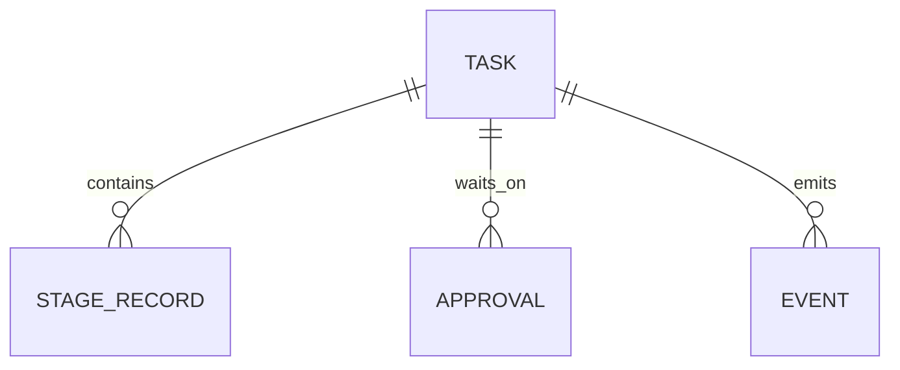

# Data Model - Untitled request

## Runtime Entities
- Task
- StageRecord
- Approval
- Event
- DeliveryRecord

## Mermaid

system-architect produced an artifact for design.
Key assumptions, risks, and next actions were captured for handoff.
VERDICT: PASS